# 示例集

一页看全工具能产出什么。以下 12 张图复用用户手册的实跑配图：除通用参数反解（`inverse_solve`，脚本内置样本）外，均由 `tests/data/injection_process.xlsx`（注塑工艺 1000 行演示数据）生成。

每个方法对应一个 `templates/example_*.yaml` 模板，命令见各节；把 `--input` 换成自己的数据、`--outdir` 指定输出目录即可复跑。参数选择与数值解读见[用户手册](user-manual/index.md)。

> 注意：图示来自用户手册的演示数据（部分节目标列为「不良率」），而各节 CLI 命令所用模板的目标列多为「拉伸强度」，两者可能不同——命令用于演示参数形态，具体数值与图形以实际数据为准。

## 要因筛选

### 相关分析（correlation）

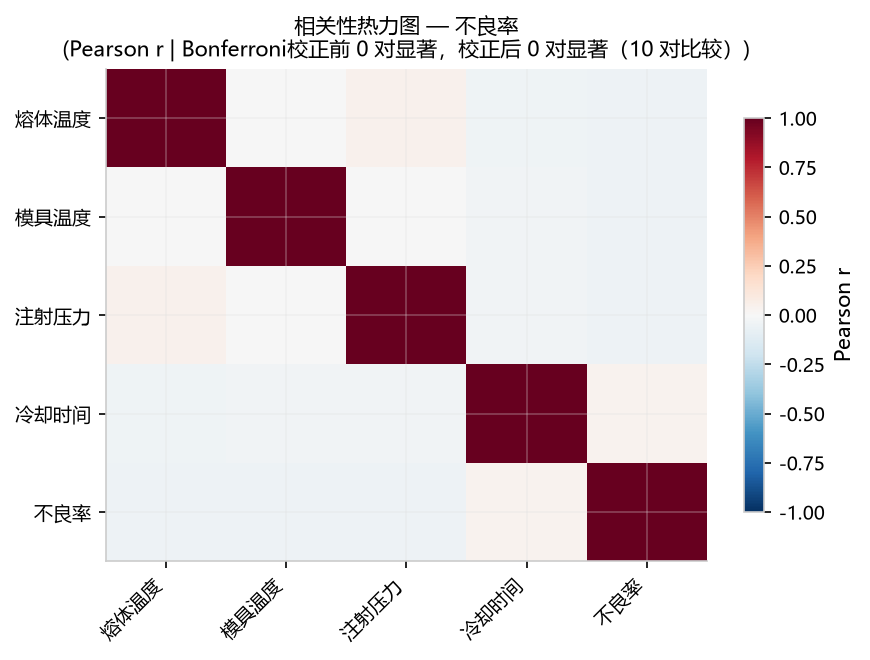

*Pearson 相关热力图：色深为相关系数，标题给出 Bonferroni 校正前后的显著对数。*

```bash
smartsuite run templates/example_correlation.yaml --input tests/data/injection_process.xlsx --outdir out/
```

### 假设检验（hypothesis_test）

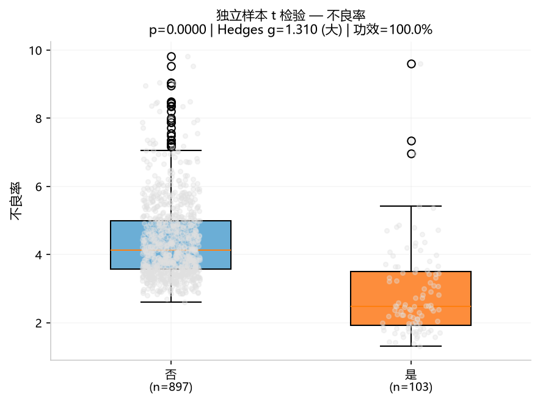

*独立样本 t 检验箱线图：保养日=否（897 例）vs 是（103 例），标题给出 p 值、效应量与统计功效。*

> 演示数据的 `原料类型` 有 5 个水平，超出两样本 t 检验要求（恰 2 组）；请把 `templates/example_hypothesis_test.yaml` 的列名替换为数据中恰 2 组的类别列（本图取 Y=`不良率`、X=`保养日`）。

## 过程监控

### CUSUM 控制图（spc_cusum）

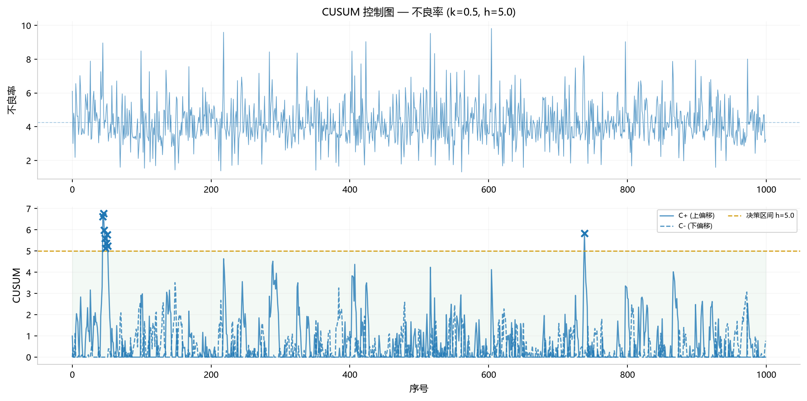

*累积和控制图：上/下偏移累计和与 h=5 决策区间，红叉为报警点（本图 9 次上偏移报警）。*

```bash
smartsuite run templates/example_spc_cusum.yaml --input tests/data/injection_process.xlsx --outdir out/
```

### 过程能力（process_capability）

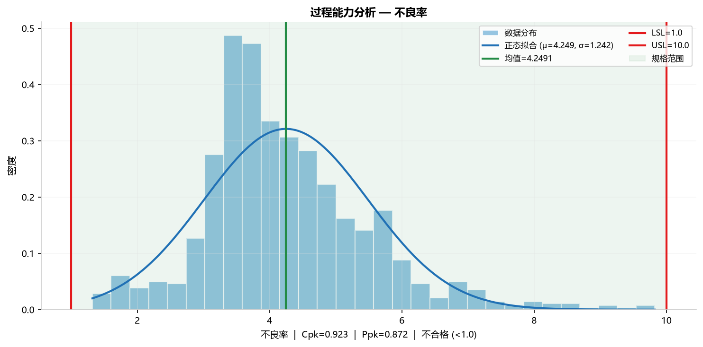

*直方图 + 正态拟合 + 规格上下限：标题给出 Cpk/Ppk 与合格判定。*

```bash
smartsuite run templates/example_process_capability.yaml --input tests/data/injection_process.xlsx --outdir out/
```

## 建模优化

### 响应曲面（response_surface）

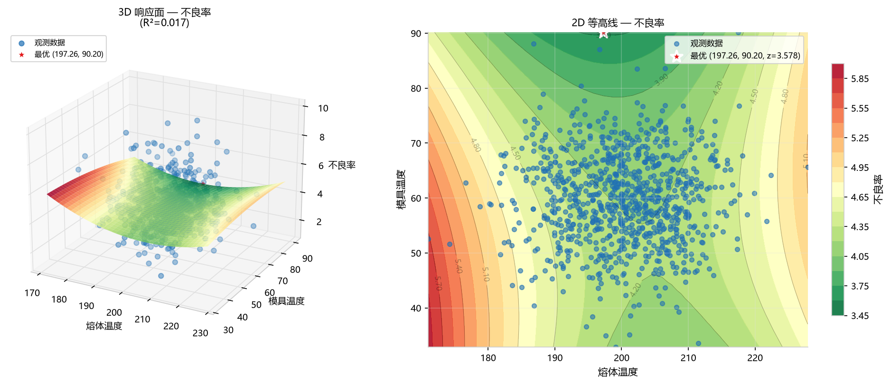

*3D 响应面 + 2D 等高线（熔体温度 × 模具温度），红星标出模型最优参数组合。*

```bash
smartsuite run templates/example_response_surface.yaml --input tests/data/injection_process.xlsx --outdir out/
```

### 通用参数反解（inverse_solve）

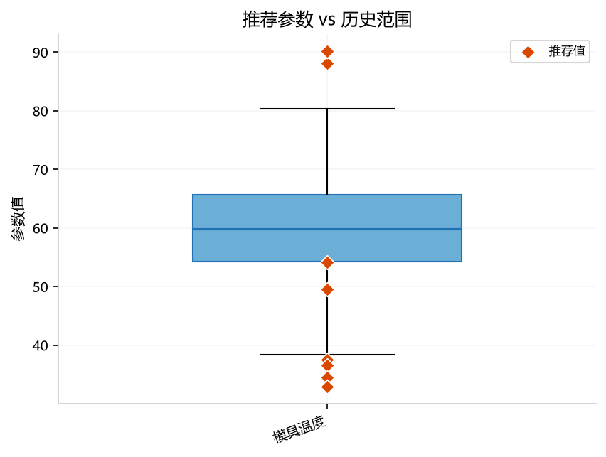

*推荐参数（橙点）叠加在历史分布箱线图上，一眼判断推荐值是否落在可行区间内。*

> 模板 `templates/example_inverse_solve.yaml` 按列名前缀自动识别角色（Incoming/来料、Variable/变量、Output/输出）；演示数据列名不含这些前缀，需在模板中显式填写 `incoming_cols`/`variable_cols`/`output_cols` 后再运行（示例见[用户手册 6.12](user-manual/06-modeling.md)）。

## 可靠性

### 生存分析（survival_analysis）

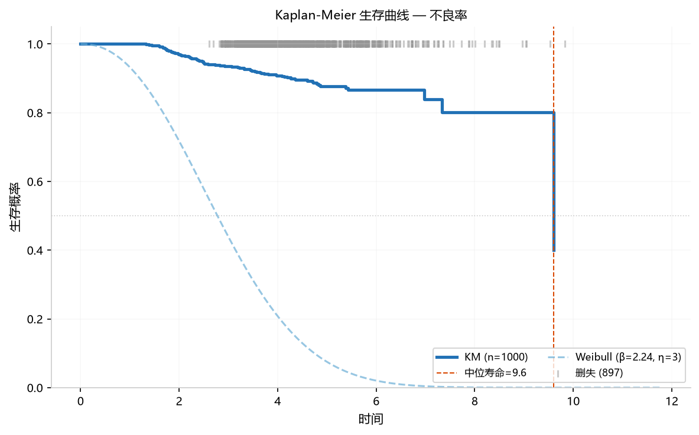

*KM 阶梯曲线 + Weibull 拟合 + 删失标记：直观呈现寿命分布与中位寿命。*

> 模板面向寿命/删失数据（`tests/data/reliability.xlsx` 含 `观测时间`/`故障`/`产品型号`）；演示数据无寿命列，本图仅为方法形态展示。

```bash
smartsuite run templates/example_survival_analysis.yaml --input tests/data/reliability.xlsx --outdir out/
```

## 异常与变点

### 异常检测（anomaly_detect）

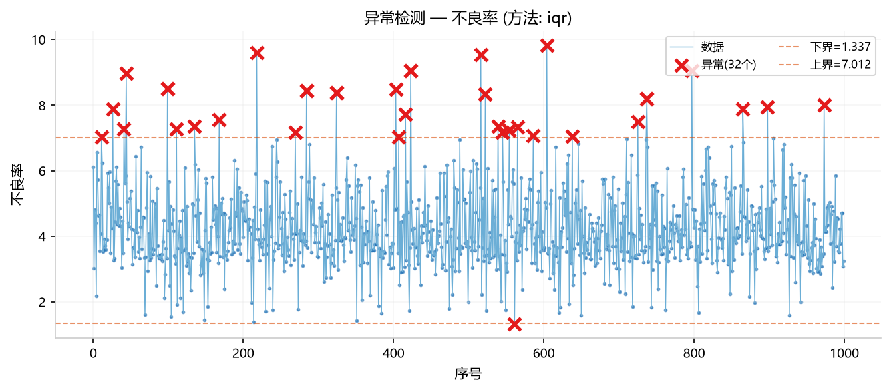

*异常点（红叉）与上/下界（橙色虚线）；本图用 IQR 法，模板默认 Grubbs，可切换 `method`。*

```bash
smartsuite run templates/example_anomaly_detect.yaml --input tests/data/injection_process.xlsx --outdir out/
```

### 变点检测（change_point）

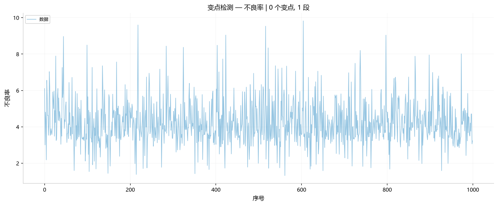

*原始序列与检出的变点/分段（演示数据随机波动，未检出显著变点）。*

```bash
smartsuite run templates/example_change_point.yaml --input tests/data/injection_process.xlsx --outdir out/
```

## 探索性

### 分布摘要（distribution_summary）

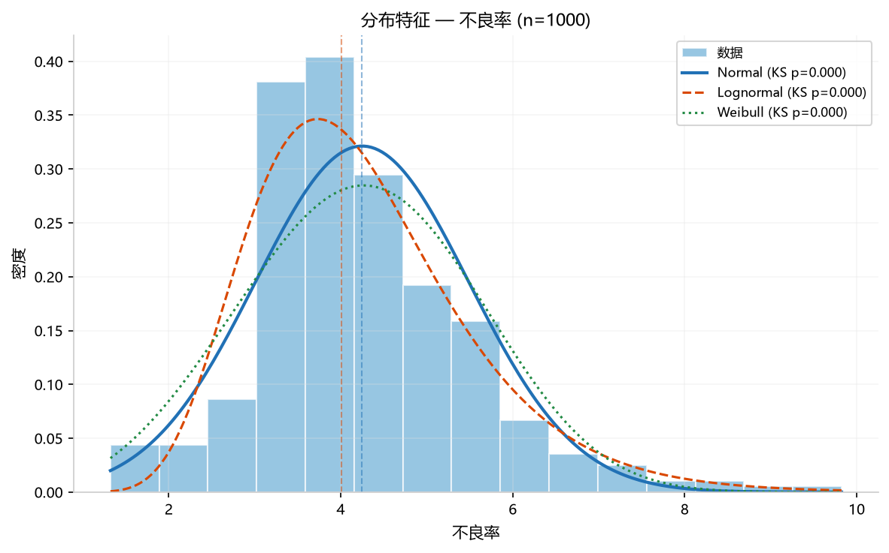

*直方图 + 正态/对数正态/Weibull 拟合（标注各拟合的 KS 检验 p 值）。*

```bash
smartsuite run templates/example_distribution_summary.yaml --input tests/data/injection_process.xlsx --outdir out/
```

### 散点图（scatter_plot）

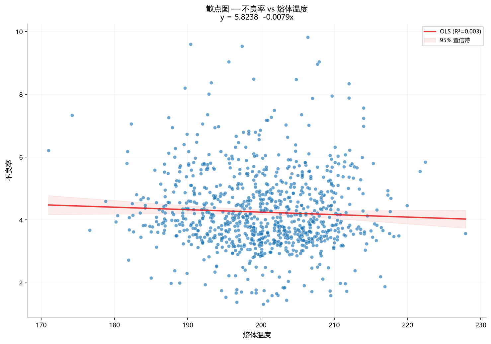

*散点 + OLS 拟合线与 95% 置信带（不良率 vs 熔体温度）。*

```bash
smartsuite run templates/example_scatter_plot.yaml --input tests/data/injection_process.xlsx --outdir out/
```

### 时间序列趋势（trend_forecast）

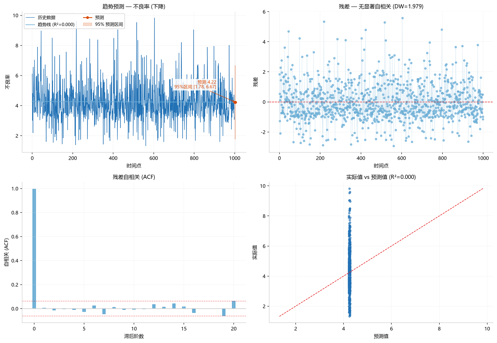

*2×2 诊断：历史与预测、残差、自相关（ACF）与实际 vs 预测。*

```bash
smartsuite run templates/example_trend_forecast.yaml --input tests/data/injection_process.xlsx --outdir out/
```
