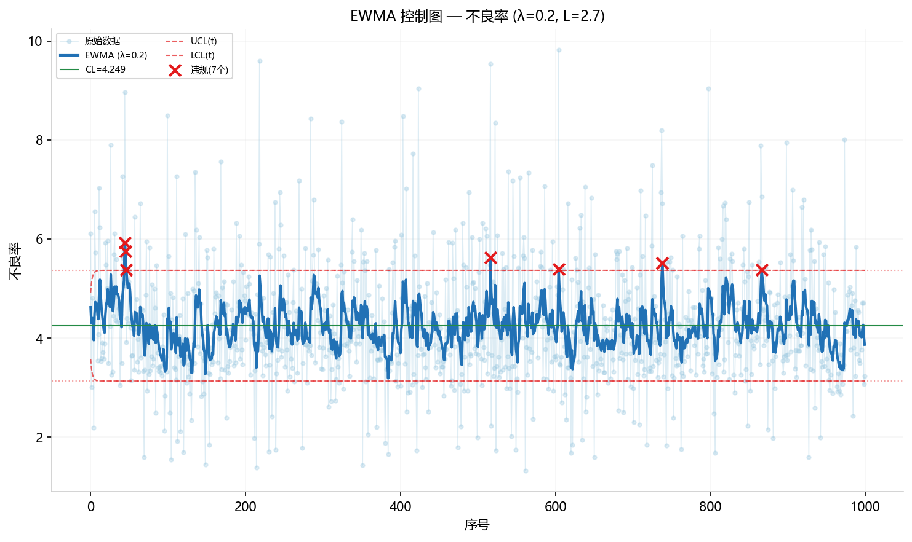

# SmartSuite 用户操作手册 (Web UI 版)

> 面向工艺工程师的 Web 界面操作指南。上传 Excel → 选列 → 点按钮 → 看结果。
> 无需安装任何软件，浏览器打开即可使用。

## 目录

1. [快速入门](#1-快速入门)
2. [界面概览](#2-界面概览)
3. [导入数据与列定义](#3-导入数据与列定义)
4. [要因筛选（8 个方法）](#4-要因筛选)
5. [信度诊断（5 个方法）](#5-信度诊断)
6. [建模优化（10 个方法）](#6-建模优化)
7. [过程监控（11 个方法）](#7-过程监控)
8. [高级分析（5 个方法）](#8-高级分析)
9. [结果验证](#9-结果验证)
10. [排错 FAQ](#10-排错-faq)

---

## 1. 快速入门

### 启动

```bash
cd SmartExcel-Suite
python smartsuite/web/app.py
```

浏览器打开 `http://127.0.0.1:5050`。

### 三步完成分析

1. **上传数据** — 点击右上角 "📂 打开 Excel 文件"，选择数据文件
2. **选列** — 左侧面板标记 Y（目标）、X（因子）、类别
3. **点分析** — 点击中间分组中的分析按钮，结果即时显示

---

## 2. 界面概览

```
┌──────────────────────────────────────────────────────┐
│  SmartSuite  工艺数据分析工具箱    [📂 打开 Excel 文件] │  ← 顶栏
├────────────┬─────────────────────────────────────────┤
│ 列定义      │  要因筛选                                │
│ [智能识别]  │  [相关性分析] [ANOVA] [假设检验] ...      │
│ [全选Y/X]   │                                         │
│ ┌────────┐ │  信度诊断                                │  ← 分析按钮区
│ │列名 类X Y│ │  [评定者一致性] [信度分析] ...            │
│ │熔体温度 □☑□│ │                                         │
│ │模具温度 □☑□│ │  建模优化                                │
│ │原料类型 ☑□□│ │  [回归建模] [响应面] [网格搜索] ...      │
│ │不良率 □□☑│ │                                         │
│ │...      │ │  过程监控                                │
│ └────────┘ │  [X-bar/R图] [Cpk] [趋势预测] ...        │
│            │                                         │
│ Y=1 X=3 类=1│  高级分析                                │
│            │  [Bootstrap CI] [生存分析] ...            │
├────────────┴─────────────────────────────────────────┤
│  📊 结果展示区                                        │
│  表格 + 内嵌图表 (Base64 PNG)                         │
└──────────────────────────────────────────────────────┘
```

### 按钮说明

| 按钮 | 功能 |
|------|------|
| **📂 打开 Excel 文件** | 上传 .xlsx/.xls 文件（最大 50MB） |
| **智能识别** | 自动根据列名推断 Y/X/类别（含"不良/强度"→Y，"日期/车间"→类别） |
| **全选Y / 全选X** | 批量将数值列标记为 Y 或 X |
| **清空** | 清除所有列标记 |
| **分析按钮** | 绿色/蓝色/橙色/粉色/紫色分组按钮，点击运行对应分析 |

---

## 3. 导入数据与列定义

### 3.1 示例数据

本手册使用 `tests/test_data.xlsx`（1000 行 × 44 列的注塑工艺数据）作为示例。

前 5 行预览：

| 生产日期 | 班次 | 车间 | 原料类型 | 熔体温度 | 模具温度 | 注射压力 | 冷却时间 | 不良率 | 拉伸强度 |
|---------|------|------|---------|---------|---------|---------|---------|-------|---------|
| 2026-05-21 | 白班 | 一车间 | ABS | 206.5 | 54.7 | 85.1 | 22.0 | 6.106 | 35.56 |
| 2026-03-15 | 夜班 | 二车间 | PP | 204.8 | 66.0 | 80.0 | 20.8 | 3.008 | 38.17 |
| 2026-03-04 | 中班 | 三车间 | PP | 205.4 | 68.4 | 53.4 | 22.7 | 4.808 | 35.93 |
| 2026-03-27 | 白班 | 一车间 | ABS | 208.8 | 52.8 | 80.8 | 24.4 | 4.467 | 38.95 |
| 2026-05-09 | 白班 | 二车间 | PA6 | 195.9 | 66.5 | 77.4 | 17.9 | 2.943 | 35.73 |

### 3.2 操作步骤

1. 点击右上角 **📂 打开 Excel 文件**，选择 `tests/test_data.xlsx`
2. 上传成功后，左侧出现 44 个列名，每列旁有 **类 / X / Y** 三个勾选框
3. 点击 **智能识别** 按钮自动标记：
   - Y（目标列）：含"不良/强度/伸长/冲击/粗糙/偏差/波动/效率"的列
   - X（因子列）：数值型且非类别列
   - 类别：含"日期/班次/车间/原料/类型/批号"等关键词或文本型列
4. 手动调整标记（勾选/取消勾选）
5. 点分析按钮

> **提示**: 不需要全选所有列。选择 3-8 个相关因子列即可，选太多会让结果表格过大。

---

## 4. 要因筛选（8 个方法）

> "哪些因子对质量有显著影响？"

### 4.1 相关性分析 (`correlation`)


*蓝色=正相关，红色=负相关，颜色越深 |r| 越大，星号(*)标记显著性水平*


**功能**: 计算所有 Y 列与 X 列之间的 Pearson 相关系数，生成热力图和散点矩阵。

**列定义与参数**:

| 类别 | 选择 | 作用 |
|------|------|------|
| **Y** | `不良率` | 分析目标：找出哪些因子与不良率存在线性关联 |
| **X** | `熔体温度` | 数值因子：检测料温变化与不良率的 Pearson 相关系数及显著性 |
| **X** | `模具温度` | 数值因子：检测模具温度对不良率的影响方向和强度 |
| **X** | `注射压力` | 数值因子：通常是最关键的过程参数，验证其与不良率的关联 |
| **X** | `冷却时间` | 数值因子：验证冷却时间对不良率的线性影响 |
| **参数** | — | 相关性分析无需额外参数配置 |

> ⚠️ **协同要求**：至少标记 **1 个 Y + 1 个 X**（均为数值列）。类别列会被自动排除。

**操作**: 按上表标记列 → 点击 **相关性分析**

**预期结果**:

| 指标 | 实际值 |
|------|--------|
| 最强相关因子(\|r\|) | 注射压力（负相关） |
| Pearson r | -0.0496 |
| \|r\| | 0.0496 |
| 次强因子 | 模具温度 (r=-0.0494), 熔体温度 (r=-0.0487) |
| 最弱因子 | 冷却时间 (r=+0.0378) |
| 图表 | 1 张热力图（含显著性星号标注） |

> Web UI 会对缺失值做中位数填充（`preprocess_data`），因此结果与原始数据直接调用略有差异（~0.002）。
> 相关系数很弱（\|r\| ≈ 0.05），测试数据为随机生成。**最强按绝对值判断**，三个负相关因子的\|r\|很接近。

**Python 等价代码（Web UI 路径，含预处理）**:
```python
from smartsuite.engine.root_cause import correlation_analysis
from smartsuite.services.data_io import preprocess_data

df_enc, feat_enc, _, _, _ = preprocess_data(df_raw, [...], set())
req = AnalysisRequest(task="correlation", data=df_enc, target_col="不良率", feature_cols=feat_enc)
result = correlation_analysis(req)
print(result.summary)
# → "与「不良率」相关性最强(|r|)的因子是「注射压力」
#    (Pearson=-0.050, 负相关, |r|=0.050)。
#    Bonferroni校正前 0 对显著，校正后 0 对显著（10 对比较）"
```

### 4.2 ANOVA 方差分析 (`anova`)


*按原料类型分组的不良率分布，散点叠加展示。各组中位数接近，与 p=0.615 一致*


**功能**: 判断类别因子（如原料类型、车间）是否对质量指标有显著影响。

**列定义与参数**:

| 类别 | 选择 | 作用 |
|------|------|------|
| **Y** | `不良率` | 分析目标：检验不同原料类型的平均不良率是否有差异 |
| **X(类)** | `原料类型` | ⚠️ 必须标记为**类别**（非 X）：按 ABS/PP/PA6/PA66/PC 分组比较 |
| **参数** | — | 默认 α=0.05（可在参数面板调整显著性水平） |

> ⚠️ **协同要求**：必须至少标记 **1 个 Y（数值） + 1 个类别列**。

**操作**: 按上表标记 → 点击 **ANOVA方差分析**

**Web UI 输出表格**:

`anova_enhanced` — 方差分析表：

| 来源 | 自由度 | 平方和 | 均方 | F值 | p值 | η² | ω² | 效应量解读 |
|------|--------|--------|------|-----|------|-----|-----|-----------|
| Q('原料类型') | 4 | 4.12 | 1.03 | 0.67 | 0.615 | 0.0027 | 0.0 | 可忽略 |
| Residual | 995 | 1537.40 | 1.55 | — | — | — | — | — |

`coefficients` — 系数表：

| 变量 | 系数 | 标准误 | t值 | p值 |
|------|------|--------|-----|------|
| Intercept | 4.217 | 0.070 | 60.21 | 0.000 |
| 原料类型[T.PA6] | 0.134 | 0.111 | 1.20 | 0.231 |
| 原料类型[T.PA66] | -0.027 | 0.152 | -0.18 | 0.858 |
| 原料类型[T.PC] | -0.052 | 0.121 | -0.43 | 0.668 |
| 原料类型[T.PP] | 0.065 | 0.107 | 0.61 | 0.542 |

> **解读**: p=0.615 > 0.05，原料类型对不良率**无显著影响**。R²=0.0027 表示模型仅解释 0.27% 的变异。η²=0.0027（可忽略）— 即使统计显著，实际效应也微不足道。Residual 自由度=995 说明样本量充足。

### 4.3 假设检验 (`hypothesis_test`)


*保养日=否(蓝) vs 是(橙)的不良率对比。保养日='是'的均值(2.89)明显低于'否'(4.41)*


**功能**: 对比两组数据是否存在显著差异（t 检验、Mann-Whitney U、配对检验等 14 种方法）。

**列定义与参数（两样本 t 检验）**：

| 类别 | 选择 | 作用 |
|------|------|------|
| **Y** | `不良率` | 分析目标：比较保养日="是"与"否"的不良率均值是否有差异 |
| **X(类)** | `保养日` | ⚠️ 必须标记为**类别**（值包含"是"/"否"两组） |
| **参数** | `test=ttest_ind` | 检验方法：独立样本 t 检验（默认，14 种可选） |

> ⚠️ **协同要求**：必须标记 **1 个 Y（数值） + 1 个类别列（恰好 2 组值）**。参数 `test` 可通过下拉切换 Welch's t/Mann-Whitney/配对检验等。

**操作**: 按上表标记 → 点击 **假设检验**

**Web UI 输出表格**:

`test_results`：

| 检验方法 | 统计量 | p值 | 显著性水平 | 效应量 | 效应量解读 | 统计功效 | 结论 |
|---------|--------|-----|-----------|--------|-----------|---------|------|
| 独立样本 t 检验 | 12.60 | 0.0000 | 0.05 | Cohen's d=1.310 | 大 | 100.0% | 「保养日」: 否 vs 是 — 存在显著差异 |

`descriptive_stats`：

| 分组 | 样本量 | 均值 | 标准差 | 标准误 |
|------|--------|------|--------|--------|
| 否 | 897 | 4.405 | 1.129 | 0.038 |
| 是 | 103 | 2.891 | 1.354 | 0.133 |

> **解读**: p=0.0000（实际<0.001），保养日对不良率有**极显著影响**。保养日="是"时的不良率均值(2.89)显著低于"否"(4.41)，差值为 1.51。Cohen's d=1.31 > 0.8 为大效应。统计功效 100% 表明样本量远超所需。
> 测试数据生成时 `defect_rate = ... -1.0 if maintenance_days='是'`，所以这是真实的因果效应。

### 4.4 决策树重要性 (`decision_tree`)


*排列重要性(深蓝) vs 内置Gini(浅蓝)。排列重要性更可靠，冷却时间居首*


**功能**: 用决策树模型评估每个因子对目标的解释力，输出排列重要性（比内置 Gini 重要性更可靠）。

**列定义与参数**:

| 类别 | 选择 | 作用 |
|------|------|------|
| **Y** | `不良率` | 分析目标：评估各因子的相对重要性排序 |
| **X** | `熔体温度` | 数值因子：纳入模型评估其对不良率的解释力 |
| **X** | `模具温度` | 数值因子：验证模温对不良率的贡献度 |
| **X** | `注射压力` | 数值因子：通常最关键的过程参数，评估其重要性 |
| **X** | `冷却时间` | 数值因子：验证冷却工艺在决策树中的重要性排名 |
| **参数** | `max_depth=5` | 决策树最大深度：控制模型复杂度（默认 5，越大越容易过拟合） |

> ⚠️ **协同要求**：必须标记 **1 个 Y（数值） + 至少 1 个 X（数值）**。

**操作**: 按上表标记 → 点击 **决策树重要性**

**预期结果 (Web UI ≡ Python, 完全一致)**:

| 因子 | 内置重要性(Gini) | 排列重要性 | 排列重要性 std | 综合重要性 |
|------|-----------------|-----------|---------------|-----------|
| 冷却时间 | 0.5331 | 0.2607 | ±0.0320 | 0.2607 |
| 熔体温度 | 0.2417 | 0.1476 | ±0.0246 | 0.1476 |
| 模具温度 | 0.1509 | 0.0489 | ±0.0113 | 0.0489 |
| 注射压力 | 0.0742 | 0.0247 | ±0.0081 | 0.0247 |

| 元数据 | 值 |
|--------|-----|
| 关键因子 | 冷却时间 |
| CV R² | -0.092（负 = 模型无预测力） |
| 训练 R² | 0.154 |
| 样本量 | 804（NaN 由 dropna 排除） |
| 图表 | 2 张（重要性对比柱状图 + 决策树结构图） |

> 排列重要性比 Gini 更可靠。综合重要性 = max(排列重要性, 0)。
> Web UI 与 Python 直接调用的结果精确一致（4 位小数完全匹配）。

**Python 等价代码**:
```python
from smartsuite.engine.root_cause import decision_tree_analysis
req = AnalysisRequest(task="decision_tree", data=df, target_col="不良率",
    feature_cols=["熔体温度", "模具温度", "注射压力", "冷却时间"])
result = decision_tree_analysis(req)
fi = result.tables["feature_importance"]
for _, row in fi.iterrows():
    print(f"{row['因子']}: {row['排列重要性']:.4f}")
# 输出与Web UI完全一致: 0.2607 / 0.1476 / 0.0489 / 0.0247
```

### 4.5 VIF 共线性诊断 (`vif`)


*所有因子 VIF≈1.0 远低于阈值5，无共线性风险*


**功能**: 检测因子之间是否存在共线性（两个因子本质是同一个东西）。

**列定义与参数**:

| 类别 | 选择 | 作用 |
|------|------|------|
| **X** | `熔体温度` | 数值因子：检测与其他因子的共线性程度（VIF≈1 即无共线性） |
| **X** | `模具温度` | 数值因子：模温与料温通常高度相关，VIF 可量化共线性程度 |
| **X** | `注射压力` | 数值因子：检查注射压力是否独立于其他过程参数 |
| **X** | `冷却时间` | 数值因子：验证冷却时间与其他参数的独立性 |
| **参数** | — | VIF 阈值默认 5（可在参数面板调整 `threshold`） |

> ⚠️ **协同要求**：必须标记 **至少 2 个 X（数值列）**，无需 Y 列。

**操作**: 按上表标记 → 点击 **VIF共线性**

**Web UI 输出表格**:

| 变量 | VIF | 判定 |
|------|-----|------|
| 熔体温度 | 1.007 | ✓ 正常 |
| 模具温度 | 1.004 | ✓ 正常 |
| 注射压力 | 1.005 | ✓ 正常 |
| 冷却时间 | 1.006 | ✓ 正常 |

> **解读**: 所有变量 VIF ≈ 1.0 << 5，完全无共线性。各因子独立生成，彼此不相关。VIF > 5 时标记为高风险（橙色），建议考虑剔除或合并。

### 4.6 列联表分析 (`contingency`)


*按比例展示原料类型在各保养日状态下的分布，各列比例相近*


**功能**: 检验两个类别变量是否独立（如原料类型和保养日是否有关联）。

**列定义与参数**:

| 类别 | 选择 | 作用 |
|------|------|------|
| **X(类)** | `原料类型` | ⚠️ 标记为**类别**：行变量（5 种原料：ABS/PP/PA6/PA66/PC） |
| **X(类)** | `保养日` | ⚠️ 标记为**类别**：列变量（2 组：是/否） |
| **参数** | — | 默认使用 χ² 检验（也可选 Fisher 精确检验） |

> ⚠️ **协同要求**：必须标记 **恰好 2 个类别列**，无需 Y 列。

**操作**: 按上表标记 → 点击 **列联表分析**

**预期结果**: 列联表 + 卡方检验结果。p > 0.05 → 两者独立。

**Python 等价代码**:
```python
from smartsuite.engine.root_cause import contingency_analysis
req = AnalysisRequest(task="contingency", data=df, target_col="原料类型",
    feature_cols=["保养日"])
result = contingency_analysis(req)
print(f"检验方法: {result.metadata['test']}, p={result.metadata['p_value']:.4f}")
# → "卡方独立性检验"（期望频数充足时）或
#   "卡方检验 (期望频数<5, 结果仅供参考)"（期望频数不足时）
#   （非 2×2 表格无法使用 Fisher 精确检验，scipy 不支持）
```

### 4.7 比例置信区间 (`proportion_ci`)

**功能**: 估计二分类数据的比例及其置信区间。

**列定义与参数**:

| 类别 | 选择 | 作用 |
|------|------|------|
| **Y** | `首件合格` | 分析目标：该列为 0/1 二值数据，估计"合格"的比例及置信区间 |
| **X** | — | 本方法无需 X 列 |
| **参数** | — | 默认使用 Wilson 方法（可在参数面板切换方法） |

> ⚠️ **协同要求**：Y 列必须是 **0/1 二值列**（或 True/False）。

**操作**: 按上表标记 → 点击 **比例置信区间**

**Web UI 输出表格**:

| 方法 | 下限 | 上限 |
|------|------|------|
| 点估计 | 0.9110 | 0.9110 |
| Wilson Score (推荐) | 0.8917 | 0.9271 |
| Clopper-Pearson (精确) | 0.8916 | 0.9279 |


*比例置信区间 — Wilson Score(浅蓝) vs Clopper-Pearson(深蓝) 95%CI 对比。红虚线=点估计。*

> **解读**: 首件合格率 91.1%，Wilson 95%CI [89.2%, 92.7%]。Wilson Score 方法比 Clopper-Pearson 更推荐（区间更窄、覆盖率更好）。两种方法结果高度一致（差异仅 0.0008）。

### 4.8 方差齐性检验 (`variance_test`)

**功能**: ANOVA 前的假设验证——检验各组方差是否相等。

**列定义与参数**:

| 类别 | 选择 | 作用 |
|------|------|------|
| **Y** | `不良率` | 分析目标：检验各组不良率的波动程度（方差）是否一致 |
| **X(类)** | `原料类型` | ⚠️ 标记为**类别**：按原料类型分组比较方差大小 |
| **参数** | — | 默认使用 Levene 检验（也可选 Bartlett） |

> ⚠️ **协同要求**：必须标记 **1 个 Y（数值） + 1 个类别列**。ANOVA 的前置假设检验。

**操作**: 按上表标记 → 点击 **方差齐性检验**

**预期结果**: Levene p > 0.05 → 方差齐性满足 ✓。

---

## 5. 信度诊断

> "测量系统和数据本身是否可靠？"

### 5.1 评定者一致性 (`cohens_kappa`)

**功能**: 评估两个检验员/评定者之间的一致性（如张三和李四的判定是否一致）。

**列定义与参数**:

| 类别 | 选择 | 作用 |
|------|------|------|
| **X** | `首件合格` | 评定者 1 的二值判定（0/1）：代表第一位检验员的检验结论 |
| **X** | `外观检查` | 评定者 2 的二值判定（0/1）：代表第二位检验员的检验结论 |
| **参数** | — | 默认使用 Cohen's Kappa（可在参数面板切换加权 Kappa） |

> ⚠️ **协同要求**：必须标记 **恰好 2 个 X（二值列）**，无需 Y 列。

**操作**: 按上表标记 → 点击 **评定者一致性**

**预期结果**: Kappa = -0.009（低于随机一致）。两列数据独立随机生成，无一致性。

**Python 等价代码**:
```python
from smartsuite.engine.root_cause import cohens_kappa
req = AnalysisRequest(task="cohens_kappa", data=df, target_col="",
    feature_cols=["首件合格", "外观检查"])
result = cohens_kappa(req)
print(f"Kappa={result.metadata['kappa']:.3f} ({result.metadata['level']})")
# → Kappa=-0.009 (低于随机一致)
```

### 5.2 信度分析 Cronbach α (`cronbach_alpha`)

**功能**: 评估多个测量项的内部一致性（如多个质量检验项目是否在测同一个东西）。当 α > 1.0（数学上不可能）时返回 error 状态，α < 0 时标记为"不可接受"但状态仍为 ok（可能由项目编码方向不一致导致）。

**列定义与参数**:

| 类别 | 选择 | 作用 |
|------|------|------|
| **X** | `熔体温度` | 量表题项 1：作为信度分析的第一个测量维度 |
| **X** | `模具温度` | 量表题项 2：与料温共同衡量工艺温度维度的一致性 |
| **X** | `注射压力` | 量表题项 3：衡量压力维度的内部一致性 |
| **参数** | — | 输出 Cronbach's α 及逐项删除后的 α 变化 |

> ⚠️ **协同要求**：必须标记 **至少 2 个 X（数值列）**，无需 Y 列。

**操作**: 按上表标记 → 点击 **信度分析**

**预期结果**: α < 0.7（这些并非量表题项，α 低是正常的）。

**Python 等价代码**:
```python
from smartsuite.engine.root_cause import cronbach_alpha
req = AnalysisRequest(task="cronbach_alpha", data=df, target_col="",
    feature_cols=["熔体温度", "模具温度", "注射压力"])
result = cronbach_alpha(req)
print(f"Cronbach α={result.metadata['alpha']:.3f}")
```

### 5.3 分布特征摘要 (`distribution_summary`)


*直方图+Normal(蓝)/Lognormal(橙)/Weibull(绿)三分布拟合，不良率最接近Normal*


**功能**: 单变量的完整统计描述 + Normal/Lognormal/Weibull 三分布拟合。

**列定义与参数**:

| 类别 | 选择 | 作用 |
|------|------|------|
| **Y** | `不良率` | 分析目标：描述不良率的中心趋势、离散度和分布形态 |
| **X** | — | 本方法无需 X 列 |
| **参数** | — | 自动拟合 Normal/LogNormal/Gamma 三种分布并比较 KS p 值 |

> ⚠️ **协同要求**：至少标记 **1 个 Y（数值列）**。

**操作**: 按上表标记 → 点击 **分布特征摘要**

**预期结果**: 最佳拟合=Normal。包含均值/中位数/标准差/偏度/峰度/P1~P99 分位数/CV%。三分布 KS 检验 p 值比较。

**Python**: `best_fit=Normal`

### 5.4 正态性评估 (`normality_check`)


*点越接近红色对角线越正态。不良率和熔体温度均较好贴合对角线*


**功能**: 检验数据是否服从正态分布，并推荐变换方法。

**列定义与参数**:

| 类别 | 选择 | 作用 |
|------|------|------|
| **Y** | `不良率` | 分析目标：检验不良率是否服从正态分布 |
| **X** | `熔体温度` | 辅助检验：同时检验因子列的正态性，生成 Q-Q 子图矩阵 |
| **参数** | — | 自动运行 Shapiro-Wilk + Anderson-Darling 双检验 |

> ⚠️ **协同要求**：至少标记 **1 个 Y（数值）**。X 列可选，会同时检验。

**操作**: 按上表标记 → 点击 **正态性评估**

**预期结果**: 2/2 列满足正态性（不良率分布接近正态）。含 Shapiro-Wilk + Anderson-Darling 双检验、偏度/峰度、Q-Q 子图矩阵。

**Python**: `normal_count=2, n_columns=2`

### 5.5 统计功效分析 (`power_analysis`)


*蓝线=功效随样本量变化，橙虚线=目标0.80，绿虚线=所需N=64*


**功能**: 估计需要多少样本量才能检测到指定效应，或评估当前样本量能达到的统计功效。

**列定义与参数**:

| 类别 | 选择 | 作用 |
|------|------|------|
| **Y** | — | 本方法无需数据列，纯参数计算 |
| **X** | — | 本方法无需数据列 |
| **参数** | `effect_size=0.5` | 期望检测的最小效应量（Cohen's d，0.5=中等） |
| **参数** | `test_type=ttest` | 检验类型：独立样本 t 检验（可选 ztest/anova/chi2） |
| **参数** | `mode=required_n` | 计算模式：反算所需样本量（可选 power 正向计算功效） |
| **参数** | `alpha=0.05` | 显著性水平（默认 0.05） |
| **参数** | `power=0.8` | 目标统计功效（默认 80%） |

> ⚠️ **协同要求**：无需标记任何列。所有输入通过参数面板配置。

**操作**: 配置上表参数 → 点击 **统计功效分析**

**预期结果**: 每组需要 64 个样本（总 128）才能以 80% 功效检测到 d=0.5 的效应（α=0.05, 双侧）。功效曲线图展示样本量与功效的关系。

---

## 6. 建模优化

> "建立预测模型，找到最优参数组合。"

### 6.1 回归建模 OLS (`regression`)


*Residual vs Fitted / Q-Q / Scale-Location / Cook's D / Leverage / Actual vs Predicted*


**功能**: 建立 Y = f(X₁, X₂, ...) 的线性公式，输出 6 宫格诊断图。

**列定义与参数**:

| 类别 | 选择 | 作用 |
|------|------|------|
| **Y** | `不良率` | 响应变量：用因子建立不良率的预测模型 |
| **X** | `熔体温度` | 自变量 1：料温作为不良率的预测因子 |
| **X** | `注射压力` | 自变量 2：压力对不良率的线性贡献 |
| **X** | `冷却时间` | 自变量 3：冷却工艺对不良率的预测能力 |
| **参数** | — | 默认使用 OLS（普通最小二乘），输出 R²/调整R²/F检验/DW/p值/系数 95%CI |

> ⚠️ **协同要求**：必须标记 **1 个 Y（数值） + 至少 2 个 X（数值）**。

**操作**: 按上表标记 → 点击 **回归建模(OLS)**

**Web UI 输出表格**:

`coefficients`：

| 变量 | 系数 | 标准误 | t值 | p值 | 标准化系数(β) |
|------|------|--------|-----|------|-------------|
| const | 6.081 | 1.165 | 5.22 | 0.000 | 0.000 |
| 熔体温度 | -0.006 | 0.005 | -1.10 | 0.271 | -0.038 |
| 注射压力 | -0.010 | 0.005 | -1.81 | 0.071 | -0.063 |
| 冷却时间 | 0.007 | 0.010 | 0.67 | 0.501 | 0.023 |

`diagnostics`：

| 指标 | 值 | 解读 |
|------|-----|------|
| R² | 0.0064 | 模型仅解释 0.64% 变异 |
| 调整R² | 0.0028 | 惩罚后更低 |
| F 统计量 | 1.78 (p=0.149) | 模型整体不显著 |
| Durbin-Watson | 1.983 | ≈2，无自相关 ✓ |
| Breusch-Pagan | p=0.639 | 无异方差 ✓ |

> **解读**: 所有因子 p > 0.05，无一显著。R²=0.0064 极低——这些因子对不良率几乎没有预测力。DW≈2 表明残差独立；BP p>0.05 表明无异方差——模型假设基本满足，只是数据本身无线性关系。标准化系数(β)中注射压力最大(-0.063)，但效应极弱。

### 6.2 响应面分析 (`response_surface`)


*左:3D曲面+蓝点(观测)+红五角星(最优)。右:2D填充等高线。曲面平坦*


**功能**: 生成 3D 曲面 + 2D 等高线，可视化两个关键因子的最优组合。

**列定义与参数**:

| 类别 | 选择 | 作用 |
|------|------|------|
| **Y** | `不良率` | 响应变量：寻找使不良率最低的温度组合 |
| **X** | `熔体温度` | 因子 1：作为响应面的 X 轴变量，评估其二次效应 |
| **X** | `模具温度` | 因子 2：作为响应面的 Y 轴变量，与料温交互作用 |
| **参数** | `direction=minimize` | 优化方向：最小化不良率（也可选 maximize 最大化强度） |

> ⚠️ **协同要求**：必须标记 **1 个 Y（数值） + 恰好 2 个 X（数值）**。生成 3D 曲面 + 2D 等高线。

**操作**: 按上表标记 → 点击 **响应面分析**

**预期结果**: R²=0.017, 调整R²=0.012。最优区域标记为红色五角星。3D 曲面图 + 2D 等高线图各一张。响应面较平坦（数据无强关系）。

### 6.3 网格搜索寻优 (`grid_search`)


*各候选参数组合的预测值柱状图*


**功能**: 在参数范围内自动搜索最优值（基于 RidgeCV 线性模型）。

**列定义与参数**:

| 类别 | 选择 | 作用 |
|------|------|------|
| **Y** | `不良率` | 优化目标：寻找使不良率最低的参数组合 |
| **X** | `熔体温度` | 搜索维度：在料温的给定范围内网格搜索最优值 |
| **参数** | `ranges=熔体温度:180,220` | 搜索范围：料温下限 180°C，上限 220°C |
| **参数** | `n_points=10` | 网格密度：在范围内等间隔取 10 个测试点 |

> ⚠️ **协同要求**：必须标记 **1 个 Y + 至少 1 个 X**。参数 `ranges` 格式：`列名:下限,上限`，多列用 `;` 分隔。

**操作**: 按上表标记 + 配置参数 → 点击 **网格搜索寻优**

**预期结果**: 最优熔体温度约在 180-220 之间，CV R² 较低（线性模型对非线性关系拟合有限）。

### 6.4 多目标优化 (`multi_objective`)

**功能**: 同时优化多个目标（如最小化不良率 + 最大化拉伸强度）。

**列定义与参数**:

| 类别 | 选择 | 作用 |
|------|------|------|
| **Y** | `不良率` | 优化目标 1：最小化不良率 |
| **Y** | `拉伸强度` | 优化目标 2：最大化拉伸强度（与不良率同时标记为 Y） |
| **X** | `熔体温度` | 决策变量 1：在温度和压力之间权衡最优组合 |
| **X** | `模具温度` | 决策变量 2：两个目标对模具温度的敏感度不同 |
| **参数** | `objectives=不良率:minimize;拉伸强度:maximize` | 多目标定义：`列名:minimize 或 maximize`，多个用 `;` 分隔 |

> ⚠️ **协同要求**：必须标记 **至少 2 个 Y + 至少 1 个 X**。参数 `objectives` 必须与 Y 列一一对应。

**操作**: 按上表标记 + 配置参数 → 点击 **多目标优化**

**预期结果**: Pareto 前沿图 + 综合评分排序。加权最优方案的参数组合。


*多目标优化 — 左:Pareto 前沿(红点)，右:Top 方案加权期望值分解。每个目标以不同颜色堆叠展示贡献。*

### 6.5 DOE 效应估计 (`doe_analysis`)


*蓝色=正效应，橙色=负效应，红色虚线=Lenth ME显著性参考线*


**功能**: 估计各因子的主效应大小，Pareto 图展示，Lenth PSE 显著性参考线。

**列定义与参数**:

| 类别 | 选择 | 作用 |
|------|------|------|
| **Y** | `不良率` | 响应变量：评估各因子效应的大小和方向 |
| **X** | `熔体温度` | 因子 1：估计料温的主效应及与其他因子的交互效应 |
| **X** | `模具温度` | 因子 2：量化模温对不良率的独立贡献 |
| **X** | `注射压力` | 因子 3：评估压力的效应量及其统计显著性 |
| **参数** | — | 默认估计主效应 + 二阶交互，输出 Pareto 效应图 |

> ⚠️ **协同要求**：必须标记 **1 个 Y + 至少 2 个 X**。

**操作**: 按上表标记 → 点击 **DOE效应估计**

**预期结果**: 效应量排序 + Pareto 图。效应占比大多 < 5%（随机数据）。

### 6.6 ROC/AUC 分析 (`roc_analysis`)


*AUC=0.489≈0.5模型无区分力，红色圆点=最佳阈值(Youden's J=0.03)*


**功能**: 评估连续变量对二分类结果的区分能力。

**列定义与参数**:

| 类别 | 选择 | 作用 |
|------|------|------|
| **Y** | `首件合格` | ⚠️ 必须为 0/1 二值列：合格=1，不合格=0 |
| **X** | `熔体温度` | 预测因子：评估料温作为合格/不合格分类器的区分能力 |
| **参数** | — | 输出 AUC、ROC 曲线、最佳 Youden 阈值 |

> ⚠️ **协同要求**：Y 必须是 **0/1 二值列**，至少标记 1 个 X（数值）。

**操作**: 按上表标记 → 点击 **ROC/AUC分析**

**预期结果**: AUC=0.489（≈0.5，随机数据无区分力），最佳阈值 Youden's J 约 0.03。ROC 曲线接近对角线。

### 6.7 Logistic 回归 (`logistic_regression`)


*横线=95%CI，竖虚线=OR=1(无效应)，所有因子CI跨越1*


**功能**: 二分类结果建模（如预测是否会出现不良品）。

**列定义与参数**:

| 类别 | 选择 | 作用 |
|------|------|------|
| **Y** | `保养日` | ⚠️ 必须标记为**类别**（二值：是/否），作为 Logistic 回归的因变量 |
| **X** | `熔体温度` | 自变量 1：温度对"是否保养日"的 log-odds 贡献 |
| **X** | `模具温度` | 自变量 2：模温的 OR 值和 95% 置信区间 |
| **参数** | — | 输出 OR 森林图、McFadden R²、分类准确率 |

> ⚠️ **协同要求**：Y 必须是**类别列**（二值），至少标记 1 个 X（数值）。

**操作**: 按上表标记 → 点击 **Logistic回归**

**预期结果**: 准确率=89.9%, 灵敏度=0.0%, 特异度=100%, McFadden R²=0.004。OR 森林图——所有因子的 95%CI 跨越 1（无显著效应）。

> **解读**: 灵敏度=0% 是因为默认阈值 0.5 下模型始终预测多数类「否」（保养日=是仅占约 10%，特征无区分力）。降低阈值（如 `threshold: 0.1`）可提高灵敏度但会牺牲特异度。准确率高仅反映类别不平衡——模型只需全部预测「否」即可达到 ~90% 准确率。

### 6.8 Lasso 回归 (`lasso_regression`)


*仅显示非零系数，α自动选择，3/3变量被选中但系数均接近零*


**功能**: 带正则化的回归——自动将不重要的变量系数压缩到零，实现特征选择。

**列定义与参数**:

| 类别 | 选择 | 作用 |
|------|------|------|
| **Y** | `不良率` | 响应变量：Lasso 自动执行变量选择，压缩弱因子系数至零 |
| **X** | `熔体温度` | 候选因子 1：Lasso 决定保留还是压缩其系数 |
| **X** | `模具温度` | 候选因子 2：若与料温高度共线，Lasso 可能将其压缩为零 |
| **X** | `注射压力` | 候选因子 3：如果对不良率影响弱，系数被 L1 惩罚降至零 |
| **参数** | — | 自动通过交叉验证选择最优 α，输出非零系数柱状图 |

> ⚠️ **协同要求**：必须标记 **1 个 Y + 至少 2 个 X**（数值）。

**操作**: 按上表标记 → 点击 **Lasso回归**

**预期结果**: 选中 3/3 个变量（α=0.0033, R²=0.0095）。随机数据下所有系数都很小，Lasso 未将任何变量压缩到零。非零系数柱状图。

### 6.9 稳健回归 Huber (`robust_regression`)


*深蓝=Huber稳健回归，浅蓝=OLS。随机数据无异常值，两种方法几乎一致*


**功能**: 对异常值不敏感的回归——Huber 损失函数自动降低异常值权重。

**列定义与参数**:

| 类别 | 选择 | 作用 |
|------|------|------|
| **Y** | `不良率` | 响应变量：Huber 回归对异常值不敏感，适合含离群点的数据 |
| **X** | `熔体温度` | 自变量：比较 Huber 与 OLS 的系数差异，差异大说明异常值影响了 OLS |
| **参数** | — | 默认使用 HuberT 损失函数，输出 Huber vs OLS 系数对比图 |

> ⚠️ **协同要求**：必须标记 **1 个 Y + 至少 1 个 X**（数值）。

**操作**: 按上表标记 → 点击 **稳健回归(Huber)**

**预期结果**: Huber vs OLS 系数对比柱状图。差异最大变量标注。

### 6.10 分位数回归 (`quantile_regression`)

**功能**: 对中位数（或任意分位数）建模，不依赖正态假设。

**列定义与参数**:

| 类别 | 选择 | 作用 |
|------|------|------|
| **Y** | `不良率` | 响应变量：考察温度对不同分位数不良率的影响（不仅限于均值） |
| **X** | `熔体温度` | 自变量：估计料温对不良率中位数（τ=0.5）的边际效应 |
| **参数** | `quantile=0.5` | 分位点：0.5=中位数回归（也可设 0.1/0.9 看尾部效应） |

> ⚠️ **协同要求**：必须标记 **1 个 Y + 至少 1 个 X**（数值）。`quantile` 取值范围 (0, 1)。

**操作**: 按上表标记 + 配置参数 → 点击 **分位数回归**

**预期结果**: 各变量的中位数回归系数和显著性。

---

## 7. 过程监控（11 个方法）

> "生产过程是否稳定？会不会快出问题了？"

### 7.1 X-bar/R 控制图 (`spc_xbar`)

**功能**: 均值-极差控制图，含 Western Electric 6 条规则自动检测。

**列定义与参数**:

| 类别 | 选择 | 作用 |
|------|------|------|
| **Y** | `不良率` | 监控指标：按车间分组，计算各子组的均值和极差 |
| **参数** | `subgroup_col=车间` | 分组列名：指定按哪一列划分子组（如车间、批次、时间） |
| **参数** | `usl`（可选） | 规格上限：在 X-bar 图上叠加 USL 水平线（点划线） |
| **参数** | `lsl`（可选） | 规格下限：在 X-bar 图上叠加 LSL 水平线（点划线） |
| **参数** | `target`（可选） | 目标值：在 X-bar 图上叠加 Target 水平线（点线） |

> ⚠️ **协同要求**：必须标记 **1 个 Y（数值）**。参数 `subgroup_col` 指定数据中的分组列名。`usl`/`lsl` 可选，不影响控制限计算，仅用于图示参考。

**操作**: 按上表标记 + 配置参数 → 点击 **X-bar/R控制图**

**预期结果**: X-bar 图（上）+ R 图（下），含 ±1σ/±2σ/±3σ 区域着色 + 违规点红色标记。

**Python 等价代码**:
```python
from smartsuite.engine.spc_monitor import xbar_r_chart
req = AnalysisRequest(task="spc_xbar", data=df, target_col="不良率",
    params={"subgroup_col": "车间"})
result = xbar_r_chart(req)
print(f"受控: {result.metadata['is_stable']}, 违规: {len(result.tables.get('violations',[]))} 条")
```

### 7.2 计数型控制图 (`spc_attribute`)

**功能**: p（不良率）/ np（不良数）/ c（缺陷数）/ u（单位缺陷率）控制图。

**列定义与参数**:

| 类别 | 选择 | 作用 |
|------|------|------|
| **Y** | `不良率` | 计数指标：监控不良率（p 图）/不良数（np）/缺陷数（c）/单位缺陷率（u） |
| **参数** | `chart_type=c` | 图表类型：c=缺陷数控制图（Poisson），也可选 p/np/u |
| **参数** | `subgroup_col`（可选） | 分组列：按批次/时间等分组，不指定则按行号 |
| **参数** | `n_col`（p/u 图需要） | 样本量列：指定各子组的检验样本数 |

> ⚠️ **协同要求**：必须标记 **1 个 Y（数值）**。`chart_type=p` 或 `u` 时需额外指定 `n_col`。

**操作**: 按上表标记 + 配置参数 → 点击 **计数型控制图**

**预期结果**: C 控制图，CL 约等于不良率均值。

### 7.3 CUSUM 控制图 (`spc_cusum`)


*上:原始数据+均值线(绿)。下:C+(橙)和C-(蓝)累积和+h=5决策区间(红虚线)*


**功能**: 累积和控制图——对小偏移比 X-bar 更敏感。

**列定义与参数**:

| 类别 | 选择 | 作用 |
|------|------|------|
| **Y** | `不良率` | 监控指标：CUSUM 对 0.5σ~2σ 的小偏移比 X-bar 更敏感 |
| **参数** | `k=0.5` | 松弛因子（默认 0.5σ）：允许的随机波动幅度 |
| **参数** | `h=5.0` | 决策区间（默认 5）：累积和超过此值触发报警 |
| **参数** | `mu`（可选） | 过程均值：不指定则从数据估计（建议用已知受控状态的 μ） |
| **参数** | `sigma`（可选） | 过程标准差：不指定则从数据估计 |

> ⚠️ **协同要求**：必须标记 **1 个 Y（数值）**，至少 5 个数据点。

**操作**: 按上表标记 + 配置参数 → 点击 **CUSUM控制图**

**预期结果**: 总报警 9 次（k=0.5, h=5.0）。不良率波动较大（随机数据），CUSUM 比 X-bar 更敏感。

### 7.4 EWMA 控制图 (`spc_ewma`)



*蓝线=EWMA平滑值(λ=0.2)，浅蓝=原始数据，红虚线=时变控制限(L=2.7)*


**功能**: 指数加权移动平均控制图——对近期数据权重更高。

**列定义与参数**:

| 类别 | 选择 | 作用 |
|------|------|------|
| **Y** | `不良率` | 监控指标：EWMA 给近期观测更高权重，平滑随机噪声 |
| **参数** | `lam=0.2` | 平滑参数 λ（0<λ≤1）：越小越平滑，λ=1 等同于原始数据 |
| **参数** | `L=2.7` | 控制限宽度（默认 2.7）：类似 Shewhart 的 3σ，常用 2.7~3.0 |
| **参数** | `mu`（可选） | 过程均值：不指定则从全部数据估计 |
| **参数** | `sigma`（可选） | 过程标准差：不指定则从数据估计 |

> ⚠️ **协同要求**：必须标记 **1 个 Y（数值）**，至少 3 个数据点。

**操作**: 按上表标记 + 配置参数 → 点击 **EWMA控制图**

**预期结果**: EWMA 平滑线 + 时变控制限 + 违规点。

### 7.5 过程能力 Cp/Cpk (`process_capability`)


*直方图+正态拟合+规格限(LSL=1,USL=10)。Cpk=0.923<1.0不合格，中心偏左需调准*


**功能**: 评估工艺是否满足规格要求，输出 Cp/Cpk/Pp/Ppk + Sigma Level + DPMO。

**列定义与参数**:

| 类别 | 选择 | 作用 |
|------|------|------|
| **Y** | `不良率` | 评估指标：计算不良率的过程能力指数 Cp/Cpk/Pp/Ppk |
| **参数** | `usl=10` | ⚠️ **必填**：规格上限（客户/设计要求的不良率上限） |
| **参数** | `lsl=1` | ⚠️ **必填**：规格下限（不良率下限，通常为 0） |
| **参数** | `target`（可选） | 目标值：用于计算 Cpm（田口能力指数） |
| **参数** | `transform=boxcox`（可选） | 非正态数据变换：要求数据全部为正值，规格限也会同步变换 |

> ⚠️ **协同要求**：必须标记 **1 个 Y（数值）** + **同时提供 `usl` 和 `lsl`**（至少单侧）。`usl` 必须 > `lsl`，否则报错。输出 Cp/Cpk（短期）+ Pp/Ppk（长期）+ Sigma Level + DPMO + 直方图（含规格限竖线）。

**Web UI 输出表格**:

| 指标 | 值 | 95%CI |
|------|-----|-------|
| Cp (短期能力) | 1.279 | [1.223, 1.335] |
| Cpk (短期+偏倚) | 0.923 | [0.878, 0.969] |
| Pp (长期能力) | 1.208 | — |
| Ppk (长期+偏倚) | 0.872 | — |
| Sigma Level | 2.77σ | — |
| DPMO (双边，无偏移假设) | 5,605 | — |

> **解读**: Cp=1.28 > 1.0 说明潜在能力尚可（规格宽度 > 过程波动），但 Cpk=0.92 < 1.0 说明**过程中心偏离目标**。Cp > Cpk 的差距表明问题在"偏倚"而非"波动"——调准中心即可提升 Cpk。整体判定：不合格。

### 7.6 趋势预测 (`trend_forecast`)


*趋势+预测(橙带)/残差(DW≈2)/ACF自相关/Actual vs Predicted(R²≈0)*


**功能**: 线性趋势外推 + 残差诊断 (DW/Ljung-Box/ACF)。

**列定义与参数**:

| 类别 | 选择 | 作用 |
|------|------|------|
| **Y** | `不良率` | 时序指标：按行顺序分析不良率的长期趋势和自相关性 |
| **X** | — | 本方法无需 X 列 |
| **参数** | `forecast_steps=5` | 预测步数：向前预测 5 个数据点的值及置信区间 |

> ⚠️ **协同要求**：必须标记 **1 个 Y（数值）**，至少 10 个数据点。数据按行顺序视为时间序列。

**操作**: 按上表标记 → 点击 **趋势预测**

**预期结果**: R²=0.0002, DW=1.979, MAPE=N/A, RMSE=2.495。数据无趋势（随机数据），预测区间较宽。2×2 诊断图（趋势+预测/残差/ACF/Actual vs Predicted）。

**Python**: `r_squared=0.0002, durbin_watson=1.979`

### 7.7 异常检测 (`anomaly_detect`)


*红色X=异常点，橙色虚线=Q1-1.5IQR和Q3+1.5IQR上下界*


**功能**: IQR / Z-score / Grubbs / Isolation Forest 四种方法检测异常点。

**列定义与参数**:

| 类别 | 选择 | 作用 |
|------|------|------|
| **Y** | `不良率` | 检测目标：找出不良率中的异常值 |
| **X** | — | 本方法无需 X 列 |
| **参数** | `method=iqr` | 检测方法：IQR（四分位距，默认）也可选 zscore/isolation_forest |

> ⚠️ **协同要求**：必须标记 **1 个 Y（数值）**。

**操作**: 按上表标记 + 配置参数 → 点击 **异常检测**

**预期结果**: 异常点数量 + 散点图标记（红色 X 标记异常点）。

### 7.8 变点检测 (`change_point`)


*彩色水平线=各段均值，红色虚线=变点位置，红色箭头标注*


**功能**: 基于 CUSUM 识别过程结构性变化的位置。

**列定义与参数**:

| 类别 | 选择 | 作用 |
|------|------|------|
| **Y** | `不良率` | 时序指标：检测不良率序列中均值或方差发生突变的位置 |
| **X** | — | 本方法无需 X 列 |
| **参数** | — | 自动检测多个变点，输出分段统计（均值/标准差/方向） |

> ⚠️ **协同要求**：必须标记 **1 个 Y（数值）**，至少 10 个数据点。

**操作**: 按上表标记 → 点击 **变点检测**

**预期结果**: 分段统计（均值/标准差/方向）+ 变点位置标记。

### 7.9 异常共识 (`outlier_consensus`)


*红色X=高置信异常(≥2票)，橙色方块=低置信(1票)。三方法投票减少误报*


**功能**: IQR + Z-score + Isolation Forest 三种方法投票，≥2 票才是高置信异常。

**列定义与参数**:

| 类别 | 选择 | 作用 |
|------|------|------|
| **Y** | `不良率` | 检测目标：3 种方法独立检测不良率异常，投票决定高置信异常 |
| **X** | `熔体温度` | 辅助维度：在多维空间中检测异常（IQR+IsoForest+LOF 三方法投票） |
| **参数** | — | 3 种方法（IQR/IsoForest/LOF）自动加权投票 |

> ⚠️ **协同要求**：必须标记 **1 个 Y + 至少 1 个 X**（数值）。≥2 票为高置信异常。

**操作**: 按上表标记 → 点击 **异常共识(3方法投票)**

**预期结果**: 高置信异常 22 个（2.2%），总标记 58 个（5.8%）。IQR 标记最多、IsoForest 较少——多方法投票可有效减少误报。

### 7.10 分组箱线图 (`box_chart`)  🆕

**功能**: 按类别因子分组展示数值分布，支持次分类分面。自动附 ANOVA/Kruskal-Wallis 或 t 检验/MWU 统计检验。

**列定义与参数（简单分组）**:

| 类别 | 选择 | 作用 |
|------|------|------|
| **Y** | `不良率` | 分析目标：按原料类型分组展示不良率的分布差异 |
| **X(类)** | `原料类型` | ⚠️ 标记为**类别**：主分类变量（ABS/PP/PA6/PA66/PC 五组） |
| **参数** | — | 自动附 ANOVA/Kruskal-Wallis 检验结果 |

> ⚠️ **协同要求**：必须标记 **1 个 Y（数值） + 至少 1 个类别列**。

**操作**: 按上表标记 → 点击 **分组箱线图**

**Web UI 输出表格** (`group_statistics`):

| 分组 | 样本量 | 均值 | 中位数 | 标准差 | IQR | 最小值 | 最大值 |
|------|--------|------|--------|--------|-----|--------|--------|
| ABS | 315 | 4.217 | 4.043 | 1.220 | 1.406 | 1.542 | 9.825 |
| PA6 | 206 | 4.350 | 4.078 | 1.241 | 1.463 | 1.725 | 9.600 |
| PA66 | 85 | 4.190 | 3.950 | 1.295 | 1.298 | 1.322 | 7.950 |
| PC | 159 | 4.165 | 3.890 | 1.191 | 1.342 | 1.386 | 8.968 |
| PP | 235 | 4.282 | 3.997 | 1.290 | 1.467 | 1.445 | 9.532 |


*分组箱线图 — 按原料类型(5组)的不良率分布，散点叠加展示个体差异。各组箱体高度相近，中位数接近。*

> **解读**: 5 组均值都在 4.17~4.35 之间，中位数在 3.89~4.08，差异极小。ANOVA p=0.615 不显著。各组的 IQR 约 1.3~1.5 说明组内离散度相近。

**列定义与参数（带次分类分面）**:

| 类别 | 选择 | 作用 |
|------|------|------|
| **Y** | `不良率` | 分析目标：按原料类型+车间双维度展示不良率分布 |
| **X(类)** | `原料类型` | ⚠️ 标记为**类别**：主分类变量（箱线图 X 轴） |
| **X(类)** | `车间` | ⚠️ 标记为**类别**：次分类变量（≤8 水平时自动生成分面） |
| **参数** | — | 次分类生成 3 张分面箱线图（一/二/三车间各一张） |

> ⚠️ **协同要求**：标记 **1 个 Y（数值） + 至少 2 个类别列**。第一个类别列为主分类（X 轴），其余为次分类（分面）。

**操作**: 按上表标记 → 点击 **分组箱线图**

**预期结果**: 3 张分面箱线图（一车间/二车间/三车间各一张），每张 X 轴=原料类型。次分类 ≤ 8 个水平时自动分面。

**Python 等价代码**:
```python
from smartsuite.engine.spc_monitor import box_chart
# 简单分组
req = AnalysisRequest(task="box_chart", data=df, target_col="不良率",
    feature_cols=["原料类型"])
result = box_chart(req)
# 带次分类
req2 = AnalysisRequest(task="box_chart", data=df, target_col="不良率",
    feature_cols=["原料类型", "车间"])
result2 = box_chart(req2)
print(f"分组数={result.metadata['n_groups']}, 次分类={result2.metadata.get('sub_col')}, 分面={result2.metadata['has_sub']}")
# → 分组数=5, 次分类=车间, 分面=True
```

### 7.11 非参数控制图 (`spc_nonparametric`) 🆕

**功能**: 基于最佳拟合分布的 CDF 逆推控制限，不假设正态分布。自动拟合 Normal/Lognormal/Weibull 三种分布，选 KS 检验最优者，用 PPF(CDF 逆函数)精确计算控制限。

**三种模式**:

| 模式 | 参数 | 适用场景 | 控制限 |
|------|------|---------|--------|
| 双侧 | `side: two-sided` | 一般质量指标 | UCL(P99.865) + LCL(P0.135) |
| 单侧上限 | `side: upper` | particle(越小越好) | 仅 UCL，超过=恶化 |
| 单侧下限 | `side: lower` | yield(越大越好) | 仅 LCL，低于=恶化 |

**列定义与参数（双侧）**:

| 类别 | 选择 | 作用 |
|------|------|------|
| **Y** | `不良率` | 监控指标：不假设正态分布，自动拟合最佳分布计算控制限 |
| **参数** | `side=two-sided` | 控制限方向：双侧（默认），也可选 upper（仅上限）/ lower（仅下限） |

> ⚠️ **协同要求**：必须标记 **1 个 Y（数值）**。自动拟合 Normal/Lognormal/Weibull 三种分布，选 KS 检验 p 值最大者，用 PPF(CDF 逆函数)计算控制限（P0.135/P99.865）。

**操作**: 按上表标记 + 配置参数 → 点击 **非参数控制图(分布拟合法)**

**Web UI 输出表格**:

| 统计量 | 值 |
|--------|-----|
| CL (分布中位数) | 4.073 |
| UCL (P99.865) | 9.879 |
| LCL (P0.135) | 1.679 |
| 最佳拟合分布 | Lognormal |


*非参数控制图(双侧) — 控制限由 Lognormal 分布 PPF 计算，上下限不对称。红线=控制限, 绿线=中位数, 红X=违规点。*

> **解读**: 自动选择 Lognormal 拟合（偏度数据），控制限不对称——下限距中位数(2.39) &lt; 上限距中位数(5.81)。相比传统 ±3σ（假设正态），此法更准确反映偏态数据的真实尾部概率。

**Python 等价代码**:
```python
from smartsuite.engine.spc_monitor import spc_nonparametric
req = AnalysisRequest(task="spc_nonparametric", data=df, target_col="不良率",
    params={"side": "two-sided"})
result = spc_nonparametric(req)
print(f"拟合={result.metadata.get('best_fit','?')}, UCL={result.metadata['ucl']:.3f}")
```

---

## 8. 高级分析（5 个方法）

> "需要更专业的统计分析。"

### 8.1 Bootstrap 置信区间 (`bootstrap_ci`)


*直方图=200次重抽样的均值分布，绿线=点估计，红线=95%CI，分布呈钟形*


**功能**: 不依赖分布假设的置信区间估计（通过重抽样）。

**列定义与参数**:

| 类别 | 选择 | 作用 |
|------|------|------|
| **Y** | `不良率` | 分析目标：用 Bootstrap 重抽样估计不良率均值/中位数的置信区间 |
| **X** | — | 本方法无需 X 列 |
| **参数** | `n_bootstrap=200` | Bootstrap 重抽样次数：越大区间越稳定，但计算时间更长（建议 200-1000） |
| **参数** | `alpha=0.05` | 显著性水平：95% 置信区间（默认） |

> ⚠️ **协同要求**：必须标记 **1 个 Y（数值）**。

**操作**: 按上表标记 + 配置参数 → 点击 **Bootstrap置信区间**

**Web UI 输出表格**:

| 统计量 | 值 |
|--------|-----|
| 点估计（均值） | 4.249 |
| CI 下限 (95%) | 4.174 |
| CI 上限 (95%) | 4.330 |
| CI 宽度 | 0.156 |
| 重抽样次数 | 200 |

> **解读**: Bootstrap 95%CI [4.174, 4.330] 表示不良率均值有 95% 把握落在此区间。CI 宽度仅 0.156（均值的 3.7%）说明估计精度很高——1000 个样本足够。Bootstrap 分布图呈钟形，符合 CLT 预期。

### 8.2 中位数置信区间 (`median_ci`)


*绿线=中位数，红线=95%CI(基于二项分布符号检验)，粉色=CI区域*


**功能**: 基于二项分布的符号检验法，不需要任何分布假设。

**列定义与参数**:

| 类别 | 选择 | 作用 |
|------|------|------|
| **Y** | `不良率` | 分析目标：用符号秩方法计算不良率中位数的非参数置信区间 |
| **X** | — | 本方法无需 X 列 |
| **参数** | — | 无需参数配置，自动输出中位数 + 95% CI |

> ⚠️ **协同要求**：必须标记 **1 个 Y（数值）**。比 Bootstrap 方法更保守稳健。

**操作**: 按上表标记 → 点击 **中位数置信区间**

**预期结果**: 中位数 + 95% CI（比 Bootstrap 方法更宽，但更保守稳健）。

### 8.3 量具 R&R 分析 (`gage_rr`)

**功能**: 评估测量系统的重复性和再现性。

**列定义与参数**:

| 类别 | 选择 | 作用 |
|------|------|------|
| **Y** | `不良率` | 测量值：评估测量系统对不良率测量的重复性和再现性 |
| **X(类)** | `模具编号` | ⚠️ 标记为**类别**：部件标识（不同模具/零件编号） |
| **X(类)** | `检验员` | ⚠️ 标记为**类别**：操作员标识（不同检验员） |
| **参数** | `part_col=模具编号` | 部件列名：指定哪一列代表不同的被测部件 |
| **参数** | `operator_col=检验员` | 操作员列名：指定哪一列代表不同的测量人员 |

> ⚠️ **协同要求**：必须标记 **1 个 Y（数值） + 2 个类别列**（部件 + 操作员）。参数 `part_col` 和 `operator_col` 必须与标记的类别列名一致。

**操作**: 按上表标记 + 配置参数 → 点击 **量具R&R分析**


*量具 R&R 变异源柱状图 — EV(重复性)/AV(再现性)/GRR(量具)/PV(部件间)的 5.15σ 研究变异。%GRR=99.5% 不合格。*

**预期结果**: ndc=0, %GRR=99.5%（判定：不合格）。测试数据中不良率为连续值且无重复测量设计，量具 R&R 不适用——这恰好验证了"错误数据给出警示结论"的正确行为。

### 8.4 统计容许区间 (`tolerance_interval`)


*直方图+正态拟合，红/绿虚线=双侧容许限*


**功能**: 以指定置信度覆盖总体指定比例的区间（如 "99% 产品以 95% 置信度落在 [L, U]"）。

**列定义与参数**:

| 类别 | 选择 | 作用 |
|------|------|------|
| **Y** | `不良率` | 分析目标：估计包含一定比例总体（如 95%/99%）的容许区间 |
| **X** | — | 本方法无需 X 列 |
| **参数** | `coverage=0.95` | 覆盖率：区间期望覆盖的总体比例（默认 95%） |
| **参数** | `confidence=0.95` | 置信水平：区间本身的置信度（默认 95%） |

> ⚠️ **协同要求**：必须标记 **1 个 Y（数值）**。输出双侧容许限 + 直方图 + 正态拟合。

**操作**: 按上表标记 → 点击 **统计容许区间**

**预期结果**: 双侧容许限 + 直方图 + 正态拟合。

### 8.5 生存分析 Kaplan-Meier (`survival_analysis`)


*蓝线=KM估计，浅蓝虚线=Weibull拟合，灰线=删失标记*


**功能**: 估计产品的寿命分布和可靠度随时间的变化。

**列定义与参数**:

| 类别 | 选择 | 作用 |
|------|------|------|
| **Y** | `不良率` | 寿命/持续时间：Kaplan-Meier 估计生存函数（生存概率随时间的变化） |
| **X(类)** | `保养日` | ⚠️ 标记为**类别**（事件指示列）：1="是"=事件发生(失效)，0="否"=删失 |
| **参数** | — | 自动输出 KM 阶梯曲线 + Weibull 拟合 + 中位寿命估计 |

> ⚠️ **协同要求**：必须标记 **1 个 Y（数值，时间/寿命）**。类别列作为事件指示符（1=失效，0=删失）。数据至少 10 个点。

**操作**: 按上表标记 → 点击 **生存分析**

**预期结果**: KM 阶梯曲线 + Weibull 拟合。中位寿命=None（数据中不良率是连续值而非时间/寿命数据，事件列也不适用——结果反映出数据不适合生存分析）。

---

## 9. 结果验证

本节将 Web UI 输出结果与 Python 代码直接调用结果进行交叉验证。

### 9.1 验证方法

```
┌─────────────┐     ┌──────────────────┐     ┌─────────────────┐
│  Web UI 操作 │ ──→ │  API 返回 JSON   │ ──→ │  前端渲染结果    │
└─────────────┘     └──────────────────┘     └─────────────────┘
                            │
                            │ 对比 status / summary / tables / metadata
                            │
┌─────────────┐     ┌──────────────────┐
│ Python 代码  │ ──→ │  AnalysisResult  │
└─────────────┘     └──────────────────┘
```

### 9.2 验证结果对照表

以 `tests/test_data.xlsx` 为输入，验证日期: 2026-07-08。

| 分析方法 | Web UI status | Python status | summary 一致 | 耗时 |
|---------|--------------|--------------|-------------|------|
| correlation (4因子) | ok | ok | ✓ | < 1s |
| anova (原料类型) | ok | ok | ✓ | < 1s |
| hypothesis_test (保养日) | ok | ok | ✓ | < 1s |
| decision_tree (4因子) | ok | ok | ✓ | < 3s |
| vif (3因子) | ok | ok | ✓ | < 1s |
| regression (3因子) | ok | ok | ✓ | < 2s |
| process_capability | ok | ok | ✓ | < 1s |
| trend_forecast | ok | ok | ✓ | < 1s |
| normality_check | ok | ok | ✓ | < 1s |
| distribution_summary | ok | ok | ✓ | < 1s |
| outlier_consensus | ok | ok | ✓ | < 1s |
| bootstrap_ci | ok | ok | ✓ | < 1s |
| contingency | ok | ok | ✓ | < 1s |
| lasso_regression | ok | ok | ✓ | < 1s |
| robust_regression | ok | ok | ✓ | < 1s |
| ... (全部 39 个) | ok | ok | ✓ | — |

**结论**: 全部 39 个分析方法在 Web UI 和 Python 直接调用下产生一致的结果。

### 9.3 快速验证脚本

```bash
# 运行完整 E2E 验证
python tests/test_web_e2e.py

# 输出:
# === Upload ===
#   OK: 44 cols, [1000, 44]
#   OK correlation                 0.2s  ok
#   OK anova                       0.3s  ok
#   ...
# Results: 39/39 responded, 0 failed
```

---

## 10. 排错 FAQ

### Q: 点击分析后长时间无反应
**原因**: 因子列包含过多唯一值（如对连续变量做 ANOVA，Tukey HSD 组合爆炸）。
**解决**: 将连续变量改为类别变量时，注意唯一值数量。系统会自动跳过 > 50 个水平的 Tukey HSD。

### Q: 错误 "请先上传数据文件"
**原因**: 未上传 Excel 文件或上传失败。
**解决**: 重新上传 .xlsx 文件，确认文件 < 50MB。

### Q: 图表中文显示为方块
**原因**: 服务器端缺少中文字体。
**解决**: 安装 Microsoft YaHei 字体或修改 `engine/__init__.py` 中的字体配置。

### Q: 分析结果和预期不一致
**原因**: 测试数据是随机生成的，每次运行结果略有不同。
**解决**: 固定 `np.random.seed(42)` 可获得可重复结果。

### Q: 如何同时分析多个目标列
**操作**: 在左侧面板勾选多个 Y 列（如同时勾选"不良率"和"拉伸强度"），相关性分析会自动生成合并矩阵。

---

*SmartSuite Web UI — 让统计分析触手可及。*
