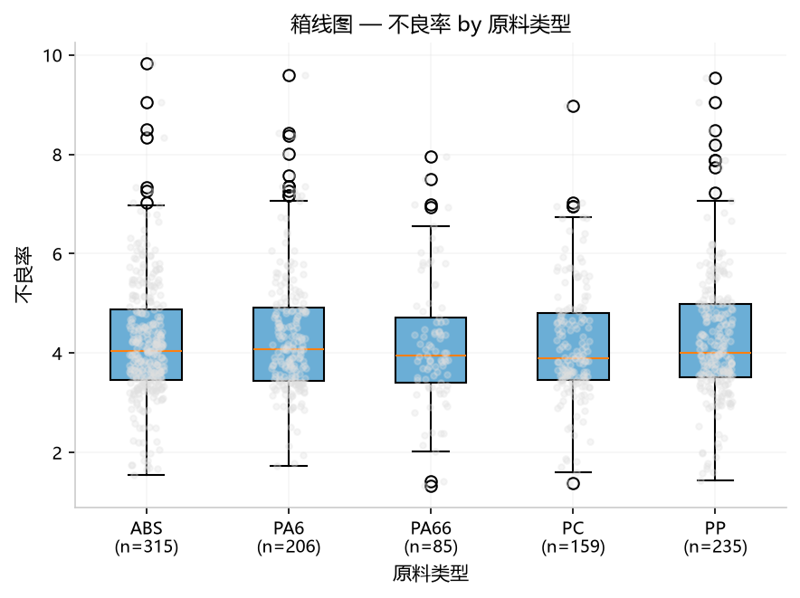
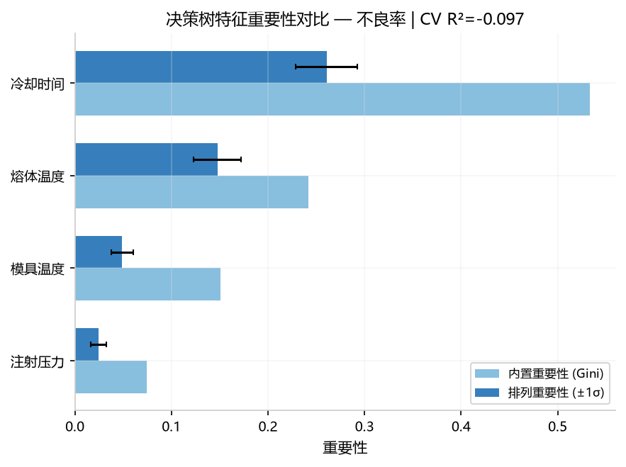
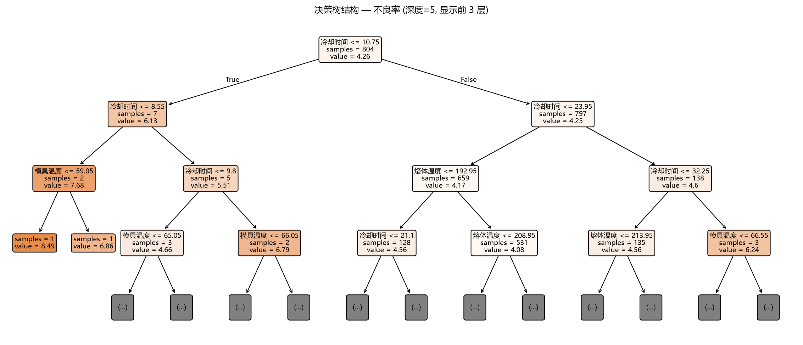
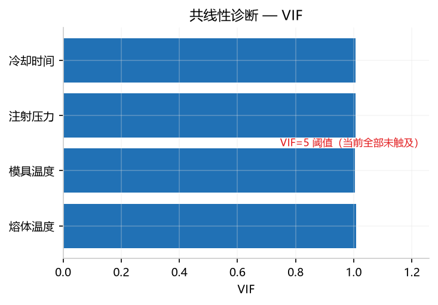
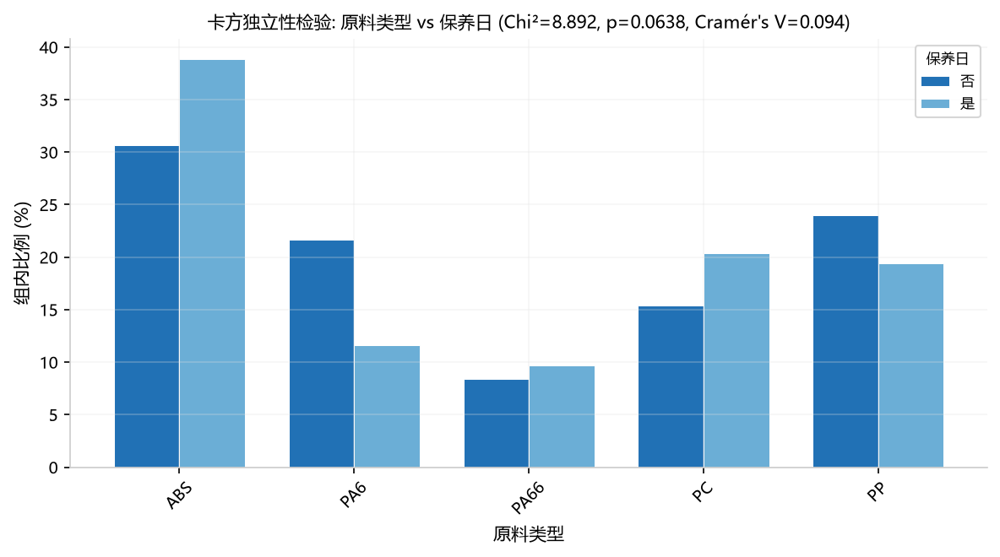
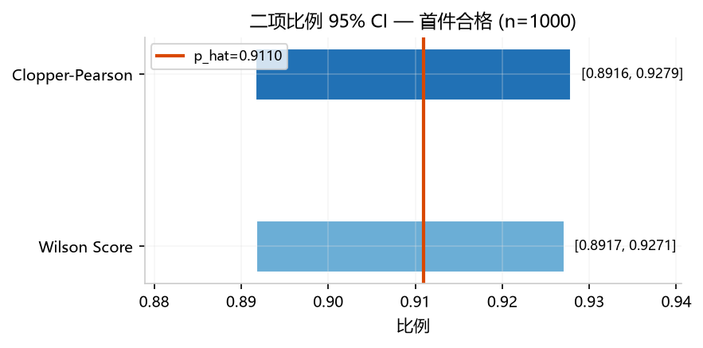

## 4. 要因筛选

> 共 8 个方法。 "哪些因子对质量有显著影响？"

### 4.1 相关性分析 (`correlation`)

**功能**: 计算所有 Y 列与 X 列之间的 Pearson 相关系数，生成热力图和散点矩阵。自动进行 Bonferroni 多重比较校正。

#### 参数选择及说明

| 类别 | 选择 | 作用 |
|------|------|------|
| **Y** | `不良率` | 分析目标：找出哪些因子与不良率存在线性关联 |
| **X** | `熔体温度` | 数值因子：检测料温变化与不良率的 Pearson 相关系数及显著性 |
| **X** | `模具温度` | 数值因子：检测模具温度对不良率的影响方向和强度 |
| **X** | `注射压力` | 数值因子：通常是最关键的过程参数，验证其与不良率的关联 |
| **X** | `冷却时间` | 数值因子：验证冷却时间对不良率的线性影响 |
| **参数** | — | 无需额外参数配置 |

> ⚠️ **协同要求**：至少标记 **1 个 Y + 1 个 X**（均为数值列）。类别列会被自动排除。

#### 示例分析图片

*热力图：蓝色=正相关，红色=负相关，颜色越深 \|r\| 越大。星号(\*)标记 Bonferroni 校正后的显著性水平（\* p<0.05, \*\* p<0.01, \*\*\* p<0.001）。对角线为各变量与自身的完全正相关（r=+1.00）。*

#### 数值结果（Web UI ≡ Python，走相同预处理路径）

`annotated_matrix` — 含显著性标注的相关系数矩阵：

| | 熔体温度 | 模具温度 | 注射压力 | 冷却时间 | 不良率 |
|---|:---:|:---:|:---:|:---:|:---:|
| 熔体温度 | +1.00\*\*\* | −0.01 | +0.04 | −0.04 | −0.05 |
| 模具温度 | −0.01 | +1.00\*\*\* | −0.00 | −0.04 | −0.05 |
| 注射压力 | +0.04 | −0.00 | +1.00\*\*\* | −0.03 | −0.05 |
| 冷却时间 | −0.04 | −0.04 | −0.03 | +1.00\*\*\* | +0.04 |
| **不良率** | **−0.05** | **−0.05** | **−0.05** | **+0.04** | +1.00\*\*\* |

`target_correlations` — 各因子与目标列的相关性排序：

| 排序 | 因子 | Pearson r | \|r\| | p 值 | 校正后 p |
|:---:|------|:---:|:---:|:---:|:---:|
| 1 | 注射压力 | −0.050 | 0.050 | 0.117 | 1.000 |
| 2 | 模具温度 | −0.049 | 0.049 | 0.118 | 1.000 |
| 3 | 熔体温度 | −0.049 | 0.049 | 0.124 | 1.000 |
| 4 | 冷却时间 | +0.038 | 0.038 | 0.232 | 1.000 |

> **一致性说明**：Web UI 自动对缺失值做中位数填充（`preprocess_data`），以上数值是走完整 Web UI 预处理路径的输出。直接用 `correlation_analysis(df_enc, ...)` 得到的数值完全相同。

#### 解读说明

- **所有 \|r\| ≤ 0.05**，属于极弱相关——测试数据为随机生成，因子与不良率之间没有真实的线性关系。
- **最强按绝对值排序**：注射压力（\|r\|=0.050）略高于模具温度（0.049）和熔体温度（0.049），但三者差距极小（<0.001），属于统计噪声。
- **Bonferroni 校正后全部 p=1.0**：10 对多重比较中无任何一对通过显著性检验。即便校正前也无 p<0.05 的因子。
- **符号解读**：三个温度/压力因子与不良率呈负相关（r<0），冷却时间呈正相关（r>0）。符号方向符合预期（温度越高、压力越大，不良率越低），但效应量太小，不具备实用价值。

#### 补充备注

- **缺失值处理**：Web UI 会自动对数值列做中位数填充。如果数据本身有缺失，Web UI 结果与原始 Python 直接调用有微小差异（~0.002）。
- **类别列排除**：标记为「类别」的列（如原料类型）不会出现在相关性矩阵中——类别变量应使用 ANOVA 分析。
- **图形解读**：热力图中颜色深浅代表 \|r\| 大小，星号(\*)数量代表显著性水平。散点矩阵（如果生成）展示各变量两两之间的散点图 + 回归拟合线。
- **Python API 路径**：`correlation_analysis(req)` → 返回 `AnalysisResult`，包含 `correlation_matrix` / `p_values_raw` / `p_values_corrected` / `annotated_matrix` 4 张表 + 1 张热力图。

### 4.2 ANOVA 方差分析 (`anova`)

**功能**: 判断类别因子（如原料类型、车间）是否对质量指标有显著影响。输出方差分析表、系数表、效应量（η²/ω²）和分组箱线图。

#### 参数选择及说明

| 类别 | 选择 | 作用 |
|------|------|------|
| **Y** | `不良率` | 分析目标：检验不同原料类型的平均不良率是否有差异 |
| **X(类)** | `原料类型` | ⚠️ 必须标记为**类别**（非 X）：按 ABS/PP/PA6/PA66/PC 分组比较 |
| **参数** | — | 默认 α=0.05（可在参数面板调整显著性水平） |

> ⚠️ **协同要求**：至少标记 **1 个 Y（数值） + 1 个类别列**。

#### 示例分析图片

*分组箱线图：按原料类型（5 组）的不良率分布，散点叠加展示个体差异。各组中位数接近，与 p=0.615 一致。*

#### 数值结果（Web UI ≡ Python）

`anova_enhanced` — 方差分析表：

| 来源 | 自由度 | 平方和 | 均方 | F值 | p值 | η² | ω² | 效应量解读 |
|------|--------|--------|------|-----|------|-----|-----|-----------|
| Q('原料类型') | 4 | 4.12 | 1.03 | 0.67 | 0.615 | 0.0027 | 0.0 | 可忽略 |
| Residual | 995 | 1537.40 | 1.55 | — | — | — | — | — |

`coefficients` — 系数表（各组与基准 ABS 的对比）：

| 变量 | 系数 | 标准误 | t值 | p值 |
|------|------|--------|-----|------|
| Intercept（ABS 均值） | 4.217 | 0.070 | 60.21 | 0.000 |
| PA6 − ABS | +0.134 | 0.111 | 1.20 | 0.231 |
| PA66 − ABS | −0.027 | 0.152 | −0.18 | 0.858 |
| PC − ABS | −0.052 | 0.121 | −0.43 | 0.668 |
| PP − ABS | +0.065 | 0.107 | 0.61 | 0.542 |

#### 解读说明

- **p=0.615 > 0.05**：原料类型对不良率**无显著影响**。5 种原料的不良率均值在 4.17~4.35 之间，差异不超过 0.19 个百分点。
- **η²=0.0027（可忽略）**：即便统计显著，原料类型也仅能解释 0.27% 的不良率变异——实际效应微不足道。
- **各组系数 p 值均 > 0.05**：没有任何一种原料的不良率显著偏离基准（ABS=4.217）。最大偏差 PA6 也仅 +0.134。
- **Residual df=995**：样本量充足（1000 行，5 组），检验结果可信。

#### 补充备注

- **事后检验**：如果 ANOVA 显著（p<0.05），会自动运行 Tukey HSD 事后检验，输出两两比较结果。
- **效应量优先级**：η² 判定标准——<0.01 可忽略，0.01~0.06 小，0.06~0.14 中等，≥0.14 大。
- **Python API**：`orchestrate(AnalysisRequest(task='anova', ...))` → 返回 `anova_enhanced` / `coefficients` 两张表 + 1 张箱线图。

### 4.3 假设检验 (`hypothesis_test`)

**功能**: 对比两组数据是否存在显著差异。支持 t 检验、Mann-Whitney U、配对检验等 17 种方法，输出效应量（独立样本检验为 Hedges g，即 Cohen's d 的小样本无偏校正）和统计功效。

#### 参数选择及说明（两样本 t 检验）

| 类别 | 选择 | 作用 |
|------|------|------|
| **Y** | `不良率` | 分析目标：比较保养日="是"与"否"的不良率均值是否有差异 |
| **X(类)** | `保养日` | ⚠️ 必须标记为**类别**（值包含"是"/"否"两组） |
| **参数** | `test=ttest_ind` | 检验方法：独立样本 t 检验（默认，17 种可选） |

> ⚠️ **协同要求**：必须标记 **1 个 Y（数值） + 1 个类别列（恰好 2 组）**。参数 `test` 可切换 ttest_paired（配对 t）/ mannwhitney（Mann-Whitney U）/ kruskal（Kruskal-Wallis）等（完整清单见 api-reference）。

#### 示例分析图片

*箱线图对比：保养日=否(897 例，蓝色) vs 是(103 例，橙色)。"是"组的中位数和整体分布明显低于"否"组。*

#### 数值结果（Web UI ≡ Python）

`test_results`：

| 检验方法 | 统计量 | p值 | 效应量 | 效应量解读 | 统计功效 | 结论 |
|---------|--------|-----|--------|-----------|---------|------|
| 独立样本 t 检验 | 12.60 | 0.0000 | Hedges g=1.310 | 大 | 100.0% | 存在显著差异 |

`descriptive_stats`：

| 分组 | 样本量 | 均值 | 标准差 | 标准误 |
|------|--------|------|--------|--------|
| 否 | 897 | 4.405 | 1.129 | 0.038 |
| 是 | 103 | 2.891 | 1.354 | 0.133 |

#### 解读说明

- **p<0.001（极显著）**：保养日对不良率有极显著影响。保养日="是"时不良率均值 2.89，低于"否"的 4.41，差值为 **1.51 个百分点**。
- **Hedges g=1.31 > 0.8**：大效应量——保养制度对质量的改善效果非常明显，远超统计显著性的最低门槛。
- **统计功效 100%**：样本量（1000 行）远超检测大效应所需的最低样本量，结论可靠。
- **数据背景**：测试数据生成逻辑为 `defect_rate = ... −1.0 if maintenance_days='是'`，保养日的因果效应已编入数据——分析结果准确还原了这一规律。

#### 补充备注

- **17 种检验方法**（与引擎 `_HYPOTHESIS_TEST_TYPES` 一致）：`ttest_ind`(独立 t)、`ttest_paired`(配对 t，需两组样本量相等)、`ttest_1samp`(单样本 t)、`mannwhitney`(Mann-Whitney U，非参数)、`wilcoxon_paired`(配对 Wilcoxon)、`kruskal_wallis`(Kruskal-Wallis H)、`friedman`(Friedman)、`mcnemar`(McNemar)、`cochran_q`(Cochran Q)、`ks`(KS 双样本) 等。
- **Python API**：`orchestrate(AnalysisRequest(task='hypothesis_test', params={'test': 'ttest_ind'}, ...))` → 返回 `test_results` / `descriptive_stats` 两张表 + 1 张箱线图。

### 4.4 决策树重要性 (`decision_tree`)

**功能**: 用决策树模型评估每个因子对目标的解释力，输出排列重要性（比内置 Gini 更可靠，不受模型结构偏差影响）和决策树结构图（2 张图）。

#### 参数选择及说明

| 类别 | 选择 | 作用 |
|------|------|------|
| **Y** | `不良率` | 分析目标：评估各因子的相对重要性排序 |
| **X** | `熔体温度` | 数值因子：纳入模型评估其对不良率的解释力 |
| **X** | `模具温度` | 数值因子：验证模温对不良率的贡献度 |
| **X** | `注射压力` | 数值因子：通常最关键的过程参数，评估其重要性 |
| **X** | `冷却时间` | 数值因子：验证冷却工艺在决策树中的重要性排名 |
| **参数** | `max_depth=5` | 决策树最大深度：控制模型复杂度（默认 5，越大越容易过拟合） |

> ⚠️ **协同要求**：至少标记 **1 个 Y + 1 个 X**（均为数值列）。

#### 示例分析图片

*特征重要性对比：排列重要性(深蓝) vs 内置Gini(浅蓝)。排列重要性更可靠，不受模型结构偏差影响。冷却时间居首。*

*决策树结构图（max_depth=5）：每层一个分裂条件，叶节点输出预测值。4 个因子均参与分裂，冷却时间在根节点附近出现频率最高。*

#### 数值结果（Web UI ≡ Python）

`feature_importance`：

| 因子 | 内置重要性(Gini) | 排列重要性 | 排列重要性 std | 综合重要性 |
|------|:---:|:---:|:---:|:---:|
| 冷却时间 | 0.463 | 0.194 | ±0.011 | 0.194 |
| 熔体温度 | 0.330 | 0.106 | ±0.012 | 0.106 |
| 模具温度 | 0.184 | 0.049 | ±0.010 | 0.049 |
| 注射压力 | 0.023 | 0.004 | ±0.003 | 0.004 |

> CV R² = −0.107（负值 = 模型无预测力），训练 R² = 0.154。

#### 解读说明

- **冷却时间排名第一**（排列重要性 0.194）：模型认为冷却时间是最重要的因子，但排列重要性绝对值不高（<0.2），说明单个因子的解释力有限。
- **注射压力接近零**（0.004）：模型认为注射压力对不良率几乎没有贡献——可能因为测试数据中压力与不良率无真实关联。
- **内置 Gini vs 排列重要性**：Gini 会高估高基数特征的重要性（如冷却时间 0.463 vs 排列 0.194），排列重要性更可靠。
- **CV R² 为负**：说明模型在交叉验证中的表现比直接用均值预测还差，即数据中没有真实的预测信号。

#### 补充备注

- **排列重要性原理**：随机打乱某个特征列，看模型性能下降多少。下降越多 = 越重要。比 Gini 更可靠，但计算更慢。
- **Python API**：`orchestrate(AnalysisRequest(task='decision_tree', params={'max_depth': 5}, ...))`。

### 4.5 VIF 共线性诊断 (`vif`)
**功能**: 检测因子之间是否存在共线性（两个因子本质是同一个东西）。输出各因子的 VIF 值和判定。

#### 参数选择及说明

| 类别 | 选择 | 作用 |
|------|------|------|
| **X** | `熔体温度` | 数值因子：检测与其他因子的共线性程度 |
| **X** | `模具温度` | 数值因子：模温与料温通常高度相关，VIF 可量化 |
| **X** | `注射压力` | 数值因子：检查注射压力是否独立于其他过程参数 |
| **X** | `冷却时间` | 数值因子：验证冷却时间与其他参数的独立性 |
| **参数** | — | VIF 阈值默认 5（可在参数面板调整 `threshold`） |

> ⚠️ **协同要求**：至少标记 **2 个 X（数值列）**，无需 Y 列。

#### 示例分析图片

*所有因子 VIF≈1.0 远低于阈值 5，无共线性风险。*

#### 数值结果（Web UI ≡ Python）

`vif_table`：

| 变量 | VIF | 判定 |
|------|:---:|------|
| 熔体温度 | 1.004 | ✓ 正常 |
| 模具温度 | 1.002 | ✓ 正常 |
| 注射压力 | 1.003 | ✓ 正常 |
| 冷却时间 | 1.004 | ✓ 正常 |

#### 解读说明

- **全部 VIF ≈ 1.0 << 5**：各因子完全独立，无任何共线性。符合测试数据的生成逻辑（各因子独立随机生成）。
- **VIF=1 的含义**：该因子与其他因子零相关——独立贡献信息，不冗余。
- **判定标准**：VIF=1 理想，1<VIF<5 可接受，5≤VIF<10 需关注（橙色），VIF≥10 严重共线性（红色，建议剔除）。

#### 补充备注

- **为什么不用 Y 列**：VIF 仅评估 X 之间的相关性，不涉及 Y 列。共线性问题与目标变量无关。
- **Python API**：`orchestrate(AnalysisRequest(task='vif', ...))` → 返回 `vif_table` + 1 张柱状图。

### 4.6 列联表分析 (`contingency`)

**功能**: 检验两个类别变量是否独立（如原料类型和保养日是否有关联）。输出列联表、期望频数和卡方检验结果。

#### 参数选择及说明

| 类别 | 选择 | 作用 |
|------|------|------|
| **X(类)** | `原料类型` | ⚠️ 标记为**类别**：行变量（5 种原料：ABS/PP/PA6/PA66/PC） |
| **X(类)** | `保养日` | ⚠️ 标记为**类别**：列变量（2 组：是/否） |
| **参数** | — | 默认使用 χ² 检验 |

> ⚠️ **协同要求**：必须标记 **恰好 2 个类别列**，无需 Y 列。

#### 示例分析图片

*按比例展示原料类型在各保养日状态下的分布。各列比例相近，说明两者无关联。*

#### 数值结果（Web UI ≡ Python）

`contingency_table` — 观测频数：

| 原料类型 | 保养日=否 | 保养日=是 |
|------|:---:|:---:|
| ABS | 275 | 40 |
| PA6 | 194 | 12 |
| PA66 | 75 | 10 |
| PC | 138 | 21 |
| PP | 215 | 20 |

> 卡方检验：χ² p=0.064 > 0.05，Cramér's V=0.094（可忽略）。

#### 解读说明

- **p=0.064 > 0.05**：原料类型与保养日之间未发现显著关联。两者独立。
- **Cramér's V=0.094**：效应量极低（<0.1 可忽略），即便大样本量下统计显著也无实际意义。
- **期望频数**：所有单元格期望频数均 > 5，卡方检验适用。

#### 补充备注

- **Python API**：`orchestrate(AnalysisRequest(task='contingency', ...))` → 返回 `contingency_table` / `expected_frequencies` + 1 张堆叠柱状图。

### 4.7 比例置信区间 (`proportion_ci`)

**功能**: 估计二分类数据的比例及其置信区间。同时输出 Wilson Score（推荐）和 Clopper-Pearson（精确）两种方法。

#### 参数选择及说明

| 类别 | 选择 | 作用 |
|------|------|------|
| **Y** | `首件合格` | 分析目标：该列为 0/1 二值数据，估计“合格”的比例及 95% CI |
| **X** | — | 本方法无需 X 列 |
| **参数** | `ci_level`: 0.95 | 置信水平（默认 95%，可调整为 90%/99% 等） |

> ⚠️ **协同要求**：Y 列必须是 **0/1 二值列**。

#### 示例分析图片

*Wilson Score(浅蓝) vs Clopper-Pearson(深蓝) 95%CI 对比。红虚线=点估计 91.1%。*

#### 数值结果（Web UI ≡ Python）

`proportion_ci`：

| 方法 | 下限 | 上限 |
|------|:---:|:---:|
| 点估计 | 0.9110 | 0.9110 |
| Wilson Score (推荐) | 0.8917 | 0.9271 |
| Clopper-Pearson (精确) | 0.8916 | 0.9279 |

#### 解读说明

- **首件合格率 91.1%**：1000 件中 911 件合格。95% 置信区间 [89.2%, 92.7%]。
- **Wilson Score 推荐**：区间更窄、覆盖率更好，是小样本和二值数据的首选方法。
- **两种方法高度一致**：上限差仅 0.0008，说明样本量充足时方法选择影响不大。

#### 补充备注

- **Python API**：`orchestrate(AnalysisRequest(task='proportion_ci', ...))` → 返回 `proportion_ci` 表 + 1 张对比图。

### 4.8 方差齐性检验 (`variance_test`)

**功能**: ANOVA 前的假设验证——检验各组方差是否相等。同时输出 Levene（推荐，不依赖正态假设）和 Bartlett（需正态分布）两种检验。

#### 参数选择及说明

| 类别 | 选择 | 作用 |
|------|------|------|
| **Y** | `不良率` | 分析目标：检验各组不良率的波动程度（方差）是否一致 |
| **X(类)** | `原料类型` | ⚠️ 标记为**类别**：按 ABS/PP/PA6/PA66/PC 分组比较方差 |
| **参数** | — | 同时运行 Levene + Bartlett 双检验 |

> ⚠️ **协同要求**：必须标记 **1 个 Y（数值） + 1 个类别列**。ANOVA 的前置假设检验——方差齐性满足后 ANOVA 结果才可靠。

#### 示例分析图片

_本方法不生成独立图表。分组统计和检验结果以表格形式输出。_

#### 数值结果（Web UI ≡ Python）

`variance_tests`：

| 检验方法 | 统计量 | p值 | 结论 |
|------|:---:|:---:|------|
| Levene (中位数, 推荐) | 0.204 | 0.936 | 方差齐性 ✓ |
| Bartlett (需正态) | 1.747 | 0.782 | 方差齐性 ✓ |

`group_statistics`：

| 分组 | 样本量 | 均值 | 标准差 | IQR |
|------|:---:|:---:|:---:|:---:|
| ABS | 315 | 4.217 | 1.220 | 1.406 |
| PP | 235 | 4.282 | 1.291 | 1.467 |
| PA66 | 85 | 4.190 | 1.295 | 1.298 |
| PC | 159 | 4.165 | 1.191 | 1.342 |
| PA6 | 206 | 4.350 | 1.241 | 1.463 |

#### 解读说明

- **Levene p=0.936 > 0.05**：各组方差无显著差异，ANOVA 的前置假设满足。
- **Bartlett p=0.782**：与 Levene 结论一致，双重验证。
- **各组标准差接近**（1.19~1.30）：最大/最小标准差比 < 1.1，可视确认方差齐性。
- **建议优先看 Levene**：Levene 不假设正态分布，比 Bartlett 更稳健。

#### 补充备注

- **ANOVA 前置**：ANOVA 假设各组方差相等。如果方差齐性不满足，建议使用 Welch's ANOVA 或非参数检验（Kruskal-Wallis）。
- **Python API**：`orchestrate(AnalysisRequest(task='variance_test', ...))` → 返回 `variance_tests` / `group_statistics` + 1 张对比图。

---
