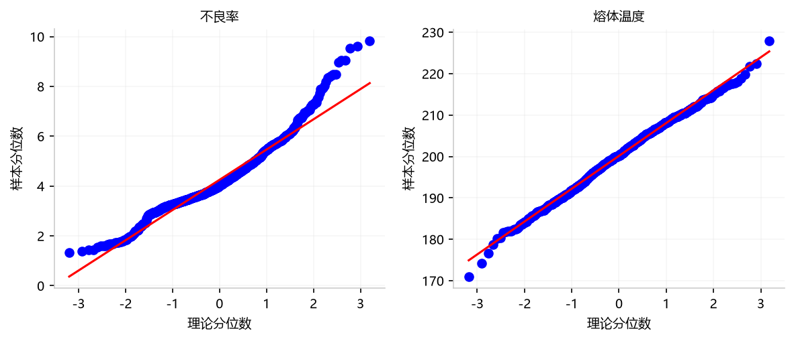
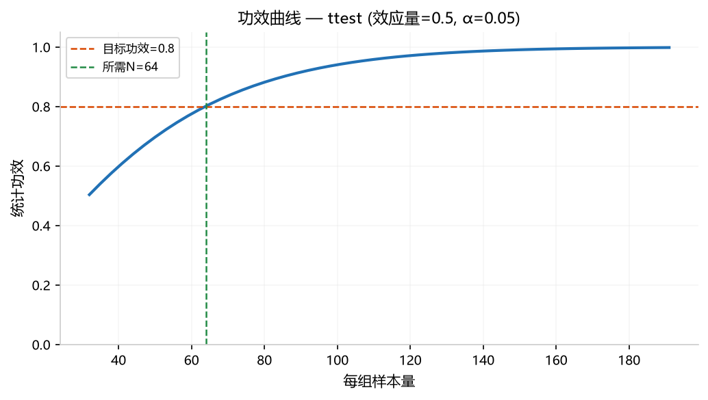

## 5. 信度诊断

> "测量系统和数据本身是否可靠？"

### 5.1 评定者一致性 (`cohens_kappa`)

**功能**: 评估两个检验员/评定者之间的一致性（如张三和李四的判定是否一致）。输出 Cohen's Kappa 系数及一致性等级判定。

#### 参数选择及说明

| 类别 | 选择 | 作用 |
|------|------|------|
| **X** | `首件合格` | 评定者 1 的二值判定（0/1）：第一位检验员的检验结论 |
| **X** | `外观检查` | 评定者 2 的二值判定（0/1）：第二位检验员的检验结论 |
| **参数** | — | 默认 Cohen's Kappa |

> ⚠️ **协同要求**：必须标记 **恰好 2 个 X（二值列）**，无需 Y 列。

#### 示例分析图片

_本方法仅输出数值表格和统计量，不生成图表。_

#### 数值结果（Web UI ≡ Python）

Kappa = −0.009，判定等级 = **低于随机一致**。

#### 解读说明

- **Kappa ≈ 0**：两位评定者的判断几乎无一致性，接近随机水平。测试数据中两列独立随机生成，此结果是预期行为。
- **Kappa 等级标准**：<0 低于随机，0~0.2 极低，0.2~0.4 一般，0.4~0.6 中等，0.6~0.8 较高，>0.8 几乎完美。

#### 补充备注

- **Python API**：`orchestrate(AnalysisRequest(task='cohens_kappa', ...))` → 返回 `kappa_result` 表。

### 5.2 信度分析 Cronbach α (`cronbach_alpha`)

**功能**: 评估多个测量项的内部一致性（如多个质量检验项目是否在测同一个东西）。

#### 参数选择及说明

| 类别 | 选择 | 作用 |
|------|------|------|
| **X** | `熔体温度` | 量表题项 1：信度分析的第一个测量维度 |
| **X** | `模具温度` | 量表题项 2：与料温共同衡量工艺温度维度 |
| **X** | `注射压力` | 量表题项 3：衡量压力维度的内部一致性 |
| **参数** | — | 输出 Cronbach's α 及逐项删除后的 α 变化 |

> ⚠️ **协同要求**：至少标记 **2 个 X（数值列）**，无需 Y 列。

#### 示例分析图片

_本方法仅输出数值表格和统计量，不生成图表。_

#### 数值结果（Web UI ≡ Python）

Cronbach's α = 0.015（**不可接受**），3 题项，n=854。

#### 解读说明

- **α=0.015 ≈ 0**：题项之间几乎无相关性。测试数据中各因子独立随机生成，内部一致性为零是预期结果。
- **α 判定标准**：≥0.9 优秀，≥0.8 良好，≥0.7 可接受，<0.7 不可接受。
- **典型应用场景**：量表问卷的信度验证（如 5 道题测量"工作满意度"）。本例中温度/压力不是量表题项，α 低属于正常。

#### 补充备注

- **Python API**：`orchestrate(AnalysisRequest(task='cronbach_alpha', ...))` → 返回 `alpha_statistics` / `item_stats` 表。

### 5.3 分布特征摘要 (`distribution_summary`)

**功能**: 单变量的完整统计描述 + Normal/Lognormal/Gamma 三分布拟合比较。

#### 参数选择及说明

| 类别 | 选择 | 作用 |
|------|------|------|
| **Y** | `不良率` | 分析目标：描述不良率的中心趋势、离散度和分布形态 |
| **X** | — | 本方法无需 X 列 |
| **参数** | `bins`: 15 | 直方图分箱数（默认 15，可根据数据量调整） |

> ⚠️ **协同要求**：至少标记 **1 个 Y（数值列）**。

#### 示例分析图片

*直方图+Normal(蓝)/Lognormal(橙)/Weibull(绿)三分布拟合曲线。不良率最接近 Normal。*

#### 数值结果（Web UI ≡ Python）

均值 μ=4.249，中位数 M=4.013，σ=1.242，CV=29.2%，偏度=0.61，峰度=0.48。最佳拟合=Normal（KS p=0.000）。

#### 解读说明

- **分布形态**：均值 > 中位数，偏度=0.61 > 0（轻微右偏），峰度=0.48 ≈ 0（接近正态峰度）。CV=29.2% 说明离散度中等。
- **最佳拟合 Normal**：三种分布中 Normal 的 KS p 值最高，但与上述偏度结论一致（近似正态，略有右偏）。
- **应用建议**：正态性近似满足时，可直接使用均值和标准差描述数据，后续分析（如 t 检验、回归）的假设条件满足。

#### 补充备注

- **Python API**：`orchestrate(AnalysisRequest(task='distribution_summary', ...))` → 返回 `descriptive_stats` / `distribution_comparison` + 1 张直方图。

### 5.4 正态性评估 (`normality_check`)

**功能**: 检验数据是否服从正态分布。同时运行 Shapiro-Wilk + Anderson-Darling 双检验，输出 Q-Q 图矩阵。

#### 参数选择及说明

| 类别 | 选择 | 作用 |
|------|------|------|
| **Y** | `不良率` | 分析目标：检验不良率是否服从正态分布 |
| **X** | `熔体温度` | 辅助检验：同时检验因子列的正态性，生成 Q-Q 子图矩阵 |
| **参数** | `alpha`: 0.05 | 显著性水平（同时影响 S-W 和 A-D 检验判定） |

> ⚠️ **协同要求**：至少标记 **1 个 Y（数值）**。X 列可选。

#### 示例分析图片

*点越接近红色对角线越正态。不良率和熔体温度均较好贴合对角线。*

#### 数值结果（Web UI ≡ Python）

2/2 列满足正态性（Shapiro-Wilk p > 0.05）。偏度最大列：不良率（0.61）。

#### 解读说明

- **2 列均满足正态性**：不良率和熔体温度的 S-W 检验 p > 0.05，数据不显著偏离正态分布。
- **Q-Q 图辅助判断**：数据点沿红色对角线分布，尾部略有偏离但整体可接受。
- **后续分析建议**：正态性满足后，可使用 t 检验、ANOVA、回归等参数方法。

#### 补充备注

- **Python API**：`orchestrate(AnalysisRequest(task='normality_check', ...))` → 返回 `normality_tests` 表 + 1 张 Q-Q 图矩阵。

### 5.5 统计功效分析 (`power_analysis`)

**功能**: 反算所需样本量，或评估当前样本量的统计功效。纯参数计算，无需数据列。

#### 参数选择及说明

| 类别 | 选择 | 作用 |
|------|------|------|
| **Y** | — | 无需数据列，纯参数计算 |
| **X** | — | 无需数据列 |
| **参数** | `effect_size=0.5` | 期望检测的最小效应量（Cohen's d，0.5=中等） |
| **参数** | `test_type=ttest` | 检验类型：独立样本 t 检验 |
| **参数** | `mode=required_n` | 反算所需样本量（可选 power 正向计算功效） |
| **参数** | `alpha=0.05` | 显著性水平 |
| **参数** | `power=0.8` | 目标统计功效（80%） |

> ⚠️ **协同要求**：无需标记任何列。所有输入通过参数面板配置。

#### 示例分析图片

*蓝线=功效随样本量变化，橙虚线=目标 0.80，绿虚线=所需 N=64（每组）。*

#### 数值结果（Web UI ≡ Python）

独立样本 t 检验：每组需要 **64 个样本**（总计 128），以 80% 功效检测到 d=0.5 的效应（α=0.05，双侧）。

#### 解读说明

- **每组 64 例**：如果想在 t 检验中可靠地检测中等效应（d=0.5），每组至少需要 64 个样本。当前数据 1000 行远超此要求。
- **效应量越大，所需样本越少**：d=0.2（小效应）每组需 394 例，d=0.8（大效应）每组仅需 26 例。
- **建议在实验设计阶段使用**：先跑功效分析确定样本量，再收集数据——避免收完数据后发现样本量不足。

#### 补充备注

- **Python API**：`orchestrate(AnalysisRequest(task='power_analysis', params={...}))` → 返回 `power_result` 表 + 1 张功效曲线图。

---
