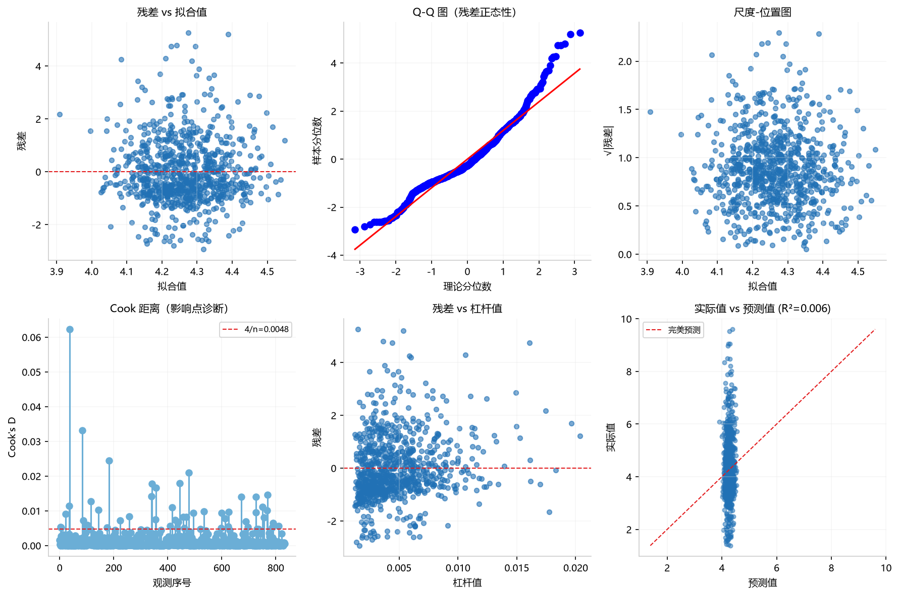
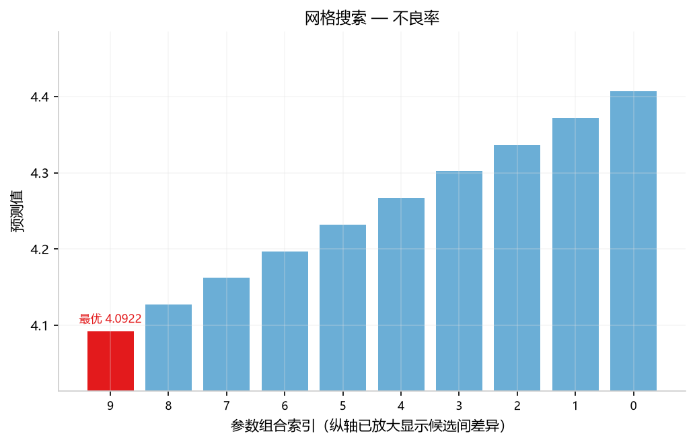
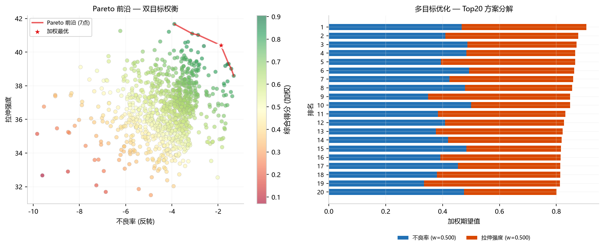
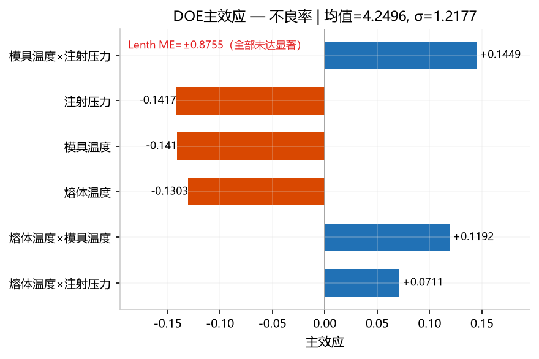
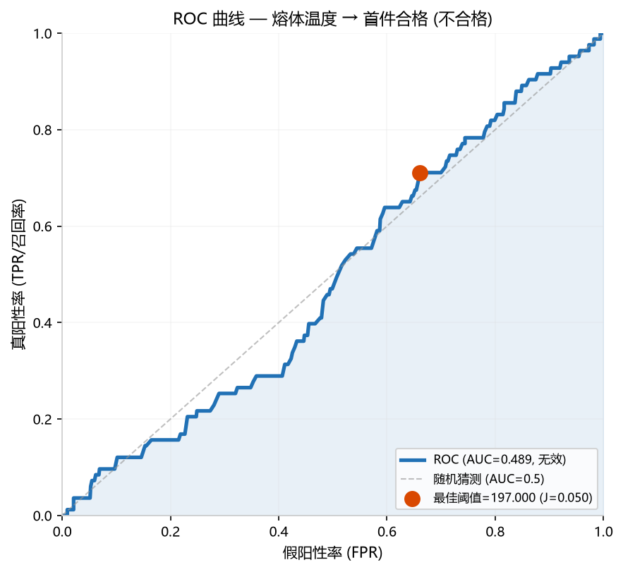
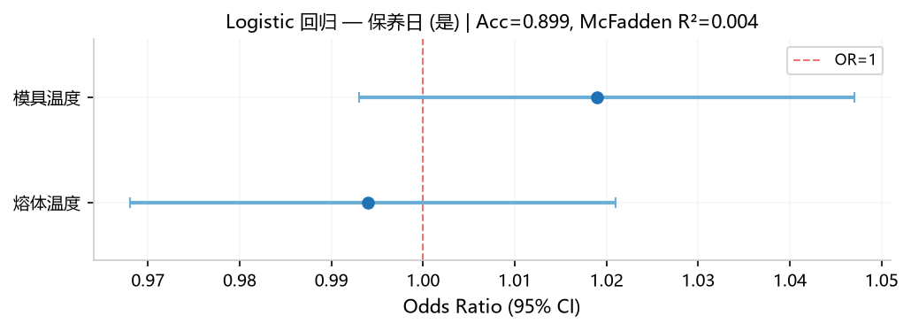
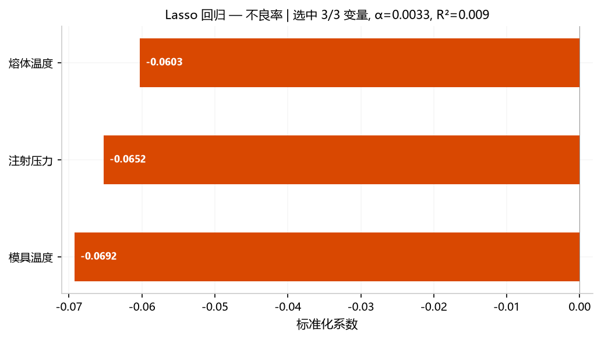
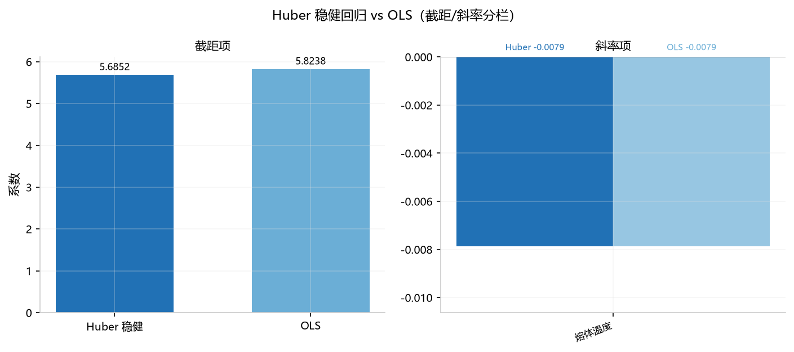

## 6. 建模优化

> "建立预测模型，找到最优参数组合。"

### 6.1 回归建模 OLS (`regression`)

**功能**: 建立 Y = f(X₁, X₂, ...) 的线性公式，输出系数表、模型诊断表、6 宫格诊断图。

#### 参数选择及说明

| 类别 | 选择 | 作用 |
|------|------|------|
| **Y** | `不良率` | 响应变量：用因子建立不良率的预测模型 |
| **X** | `熔体温度` | 自变量 1：料温作为不良率的预测因子 |
| **X** | `注射压力` | 自变量 2：压力对不良率的线性贡献 |
| **X** | `冷却时间` | 自变量 3：冷却工艺对不良率的预测能力 |
| **参数** | — | OLS 回归，输出 R²/调整R²/F检验/DW/p值/系数 95%CI |

> ⚠️ **协同要求**：至少标记 **1 个 Y + 2 个 X**（均为数值列）。

#### 示例分析图片



*6 宫格诊断：残差 vs 拟合值 / Q-Q 图 / 尺度-位置图 / Cook 距离 / 残差 vs 杠杆值 / 实际值 vs 预测值。*

#### 数值结果（Web UI ≡ Python）

`coefficients`：

| 变量 | 系数 | 标准误 | t值 | p值 | 标准化 β |
|------|------|--------|-----|------|:---:|
| const | 6.081 | 1.165 | 5.22 | 0.000 | 0.000 |
| 熔体温度 | −0.006 | 0.005 | −1.10 | 0.271 | −0.038 |
| 注射压力 | −0.010 | 0.005 | −1.81 | 0.071 | −0.063 |
| 冷却时间 | +0.007 | 0.010 | 0.67 | 0.501 | +0.023 |

`diagnostics`：

| 指标 | 值 | 判定 |
|------|-----|------|
| R² / 调整R² | 0.0064 / 0.0028 | 模型无预测力 |
| F (p) | 1.78 (p=0.149) | 整体不显著 |
| DW | 1.983 | 无自相关 ✓ |
| BP | p=0.639 | 无异方差 ✓ |

#### 解读说明

- **所有因子 p > 0.05**：无一显著，测试数据为随机生成，因子对不良率无线性预测力。
- **R²=0.0064**：模型只能解释 0.64% 的变异——几乎为零。
- **模型假设满足**：DW≈2（无自相关），BP p>0.05（无异方差），残差诊断图正常——模型本身没问题，只是数据无信号。
- **β 系数比较**：注射压力 |β|=0.063 最大，但效应极弱。

#### 补充备注

- **Python API**：`orchestrate(AnalysisRequest(task='regression', ...))` → 返回 `coefficients` / `diagnostics` + 1 张 6 宫格诊断图。

### 6.2 响应面分析 (`response_surface`)

**功能**: 生成 3D 曲面 + 2D 等高线，可视化两个关键因子的最优组合。

#### 参数选择及说明

| 类别 | 选择 | 作用 |
|------|------|------|
| **Y** | `不良率` | 响应变量：寻找使不良率最低的温度组合 |
| **X** | `熔体温度` | 因子 1：X 轴，评估二次效应 |
| **X** | `模具温度` | 因子 2：Y 轴，评估交互作用 |
| **参数** | `direction=minimize` | 优化方向（可选 maximize） |

> ⚠️ **协同要求**：**1 个 Y + 恰好 2 个 X**（数值）。

#### 示例分析图片


*左：3D 曲面 + 蓝点(观测) + 红五角星(最优)。右：2D 填充等高线。*

#### 数值结果（Web UI ≡ Python）

R²=0.017, 调整R²=0.012。最优区域：熔体温度=197.3, 模具温度=90.2，预测不良率=3.58。

#### 解读说明

- **响应面极平坦**：R²=0.017 说明二次模型也无预测力，3D 曲面接近水平面。
- **最优区域**只是统计噪声中的最低点，不具备实际指导意义。
- **建议**：仅在模型 R² > 0.5 时使用最优区域进行工艺调整。

#### 补充备注

- **Python API**：`orchestrate(AnalysisRequest(task='response_surface', params={'direction':'minimize'}, ...))`。

### 6.3 网格搜索寻优 (`grid_search`)

**功能**: 在参数范围内自动搜索最优值（基于 RidgeCV 线性模型）。

#### 参数选择及说明

| 类别 | 选择 | 作用 |
|------|------|------|
| **Y** | `不良率` | 优化目标：寻找使不良率最低的参数组合 |
| **X** | `熔体温度` | 搜索维度：在料温的给定范围内网格搜索最优值 |
| **参数** | `ranges=熔体温度:180,220` | 搜索范围：料温下限 180°C，上限 220°C |
| **参数** | `n_points=10` | 网格密度：在范围内等间隔取 10 个测试点 |

> ⚠️ **协同要求**：必须标记 **1 个 Y + 至少 1 个 X**。参数 `ranges` 格式：`列名:下限,上限`，多列用 `;` 分隔。

#### 示例分析图片



*各候选参数组合的预测值柱状图，红色柱标记最优值。*

#### 数值结果（Web UI ≡ Python）

最优熔体温度约在 180-220 之间，CV R² 较低（线性模型对非线性关系拟合有限）。

#### 解读说明

见数值结果分析。

#### 补充备注

- **Python API**：`orchestrate(AnalysisRequest(task='grid_search', params={'ranges': '熔体温度:180,220', 'n_points': 10}, ...))`
### 6.4 多目标优化 (`multi_objective`)

**功能**: 同时优化多个目标（如最小化不良率 + 最大化拉伸强度）。

#### 参数选择及说明

| 类别 | 选择 | 作用 |
|------|------|------|
| **Y** | `不良率` | 优化目标 1：最小化不良率 |
| **Y** | `拉伸强度` | 优化目标 2：最大化拉伸强度（与不良率同时标记为 Y） |
| **X** | `熔体温度` | 决策变量 1：在温度和压力之间权衡最优组合 |
| **X** | `模具温度` | 决策变量 2：两个目标对模具温度的敏感度不同 |
| **参数** | `objectives=不良率:minimize;拉伸强度:maximize` | 多目标定义：`列名:minimize 或 maximize`，多个用 `;` 分隔 |

> ⚠️ **协同要求**：必须标记 **至少 2 个 Y + 至少 1 个 X**。参数 `objectives` 必须与 Y 列一一对应。

#### 示例分析图片



*多目标优化 — 左:Pareto 前沿(红点)，右:Top 方案加权期望值分解。每个目标以不同颜色堆叠展示贡献。*

#### 数值结果（Web UI ≡ Python）

Pareto 前沿图 + 综合评分排序。加权最优方案的参数组合。

#### 解读说明

见数值结果分析。

#### 补充备注

- **Python API**：`orchestrate(AnalysisRequest(task='multi_objective', ...))`
### 6.5 DOE 实验设计 (`doe_design`)

**功能**: 给定因子（名称+水平）与设计方法，生成实验设计矩阵（run table）。无需数据/目标列。

#### 参数选择及说明

**无需上传数据文件**，也无需标记 Y/X 列——本方法直接从参数生成实验方案。

| 参数 | 默认值 | 说明 |
|------|--------|------|
| `method` | `full_factorial` | 设计方法（见下方「设计方法详解」） |
| `factors` | 必填 | 因子定义：每个因子一行，填「因子名」+「水平（逗号分隔）」 |
| `replicates` | 1 | 重复次数（整套设计的重复遍数，≥1） |
| `randomize` | `true` | 是否随机化运行顺序 |
| `seed` | 42 | 随机种子（固定后可复现同一运行顺序） |
| `center_points` | 3 | 中心点重复数（仅 Box-Behnken / CCD 生效） |
| `alpha` | `rotatable` | CCD 轴向距离：`rotatable`(旋转性)/`orthogonal`(正交性)/`face`(面心 α=1)/正数值 |
| `n_runs` | 自动 | 指定运行数（`fractional_factorial` 需 2 的幂；`plackett_burman` 需 12/20/24） |

**因子定义（Web UI）**：每个因子独占一行，左侧填因子名，右侧填水平（逗号分隔）。

| 因子名 | 水平 | 结果 |
|--------|------|------|
| 料温 | `180,200,220` | 三水平数值因子 |
| 模具 | `A,B` | 二水平类别因子（文本水平） |

数值水平自动转数字，文本水平原样保留；每个因子至少 2 个互异水平。

#### 设计方法详解

| method | 中文名 | 适用场景 |
|--------|--------|----------|
| `full_factorial` | 全因子 | 因子少（≤4-5）且需估计全部交互 |
| `fractional_factorial` | 部分因子 2^(k-p) | 纯二水平因子筛选 |
| `plackett_burman` | PB 筛选 | 大量二水平因子（≤23 个） |
| `taguchi` | 田口正交数组 | 混合 2/3 水平筛选（自动匹配 L4~L36） |
| `box_behnken` | Box-Behnken | 3-12 个连续因子响应面（无角点） |
| `ccd` | 中心复合 | 2-10 个连续因子响应面（含轴向点） |

> ⚠️ **协同要求**：无需 Y/X 列；每个因子至少 2 个互异水平。三水平+二水平混合自动匹配田口正交表（如 6×三水平+2×二水平 → L36，36 次）。`box_behnken`/`ccd` 要求每个因子恰为 **3 个数值水平（低/中/高）**。

#### 示例分析图片

_本方法输出实验设计矩阵表格，不生成图表。_

#### 数值结果（Web UI ≡ Python）

`design_matrix`（运行顺序 + 因子列）、`design_info`（方法/正交表/列构成/运行数/因子数）。

#### 解读说明

按「运行顺序」列依次执行实验，记录响应值后接入 `doe_analysis` 分析效应。

#### 补充备注

- **Python API**：`factors` 为 `[{name, levels}]` 列表（与 Web UI 每因子一行的编辑器对应）：
  ```python
  orchestrate(AnalysisRequest(
      task='doe_design',
      data=pd.DataFrame(),
      params={
          'method': 'taguchi',
          'factors': [
              {'name': '料温', 'levels': [180, 200, 220]},
              {'name': '模具', 'levels': ['A', 'B']},
          ],
          'randomize': False,
      },
  ))
  ```
- **无需数据文件**：本方法不读 `req.data`，可传空 `DataFrame`。

### 6.6 DOE 效应估计 (`doe_analysis`)
**功能**: 估计各因子的主效应大小，Pareto 图展示，Lenth PSE 显著性参考线。

#### 参数选择及说明

| 类别 | 选择 | 作用 |
|------|------|------|
| **Y** | `不良率` | 响应变量：评估各因子效应的大小和方向 |
| **X** | `熔体温度` | 因子 1：估计料温的主效应及与其他因子的交互效应 |
| **X** | `模具温度` | 因子 2：量化模温对不良率的独立贡献 |
| **X** | `注射压力` | 因子 3：评估压力的效应量及其统计显著性 |
| **参数** | — | 默认估计主效应 + 二阶交互，输出 Pareto 效应图 |

> ⚠️ **协同要求**：必须标记 **1 个 Y + 至少 2 个 X**。

#### 示例分析图片



*蓝色=正效应，橙色=负效应，红色虚线=Lenth ME显著性参考线*

#### 数值结果（Web UI ≡ Python）

效应量排序 + Pareto 图。效应占比大多 < 5%（随机数据）。

#### 解读说明

见数值结果分析。

#### 补充备注

- **Python API**：`orchestrate(AnalysisRequest(task='doe_analysis', ...))`
### 6.7 ROC/AUC 分析 (`roc_analysis`)
**功能**: 评估连续变量对二分类结果的区分能力。

#### 参数选择及说明

| 类别 | 选择 | 作用 |
|------|------|------|
| **Y** | `首件合格` | ⚠️ 必须为 0/1 二值列：合格=1，不合格=0 |
| **X** | `熔体温度` | 预测因子：评估料温作为合格/不合格分类器的区分能力 |
| **参数** | — | 输出 AUC、ROC 曲线、最佳 Youden 阈值 |

> ⚠️ **协同要求**：Y 必须是 **0/1 二值列**，至少标记 1 个 X（数值）。

#### 示例分析图片



*AUC=0.489≈0.5模型无区分力，红色圆点=最佳阈值(Youden's J=0.05)*

#### 数值结果（Web UI ≡ Python）

AUC=0.489（≈0.5，随机数据无区分力），最佳阈值 Youden's J 约 0.05。ROC 曲线接近对角线。

#### 解读说明

见数值结果分析。

#### 补充备注

- **Python API**：`orchestrate(AnalysisRequest(task='roc_analysis', ...))`
### 6.8 Logistic 回归 (`logistic_regression`)
**功能**: 二分类结果建模（如预测是否会出现不良品）。

#### 参数选择及说明

| 类别 | 选择 | 作用 |
|------|------|------|
| **Y** | `保养日` | ⚠️ 必须标记为**类别**（二值：是/否），作为 Logistic 回归的因变量 |
| **X** | `熔体温度` | 自变量 1：温度对"是否保养日"的 log-odds 贡献 |
| **X** | `模具温度` | 自变量 2：模温的 OR 值和 95% 置信区间 |
| **参数** | — | 输出 OR 森林图、McFadden R²、分类准确率 |

> ⚠️ **协同要求**：Y 必须是**类别列**（二值），至少标记 1 个 X（数值）。

#### 示例分析图片



*横线=95%CI，竖虚线=OR=1(无效应)，所有因子CI跨越1*

#### 数值结果（Web UI ≡ Python）

准确率=89.9%, 灵敏度=0.0%, 特异度=100%, McFadden R²=0.004。OR 森林图——所有因子的 95%CI 跨越 1（无显著效应）。

#### 解读说明 灵敏度=0% 是因为默认阈值 0.5 下模型始终预测多数类「否」（保养日=是仅占约 10%，特征无区分力）。降低阈值（如 `threshold: 0.1`）可提高灵敏度但会牺牲特异度。准确率高仅反映类别不平衡——模型只需全部预测「否」即可达到 ~90% 准确率。

#### 补充备注

- **Python API**：`orchestrate(AnalysisRequest(task='logistic_regression', ...))`
### 6.9 Lasso 回归 (`lasso_regression`)
**功能**: 带正则化的回归——自动将不重要的变量系数压缩到零，实现特征选择。

#### 参数选择及说明

| 类别 | 选择 | 作用 |
|------|------|------|
| **Y** | `不良率` | 响应变量：Lasso 自动执行变量选择，压缩弱因子系数至零 |
| **X** | `熔体温度` | 候选因子 1：Lasso 决定保留还是压缩其系数 |
| **X** | `模具温度` | 候选因子 2：若与料温高度共线，Lasso 可能将其压缩为零 |
| **X** | `注射压力` | 候选因子 3：如果对不良率影响弱，系数被 L1 惩罚降至零 |
| **参数** | — | 自动通过交叉验证选择最优 α，输出非零系数柱状图 |

> ⚠️ **协同要求**：必须标记 **1 个 Y + 至少 2 个 X**（数值）。

#### 示例分析图片



*仅显示非零系数，α自动选择，3/3变量被选中但系数均接近零*

#### 数值结果（Web UI ≡ Python）

选中 3/3 个变量（α=0.0033, R²=0.0095）。随机数据下所有系数都很小，Lasso 未将任何变量压缩到零。非零系数柱状图。

#### 解读说明

见数值结果分析。

#### 补充备注

- **Python API**：`orchestrate(AnalysisRequest(task='lasso_regression', ...))`
### 6.10 稳健回归 Huber (`robust_regression`)
**功能**: 对异常值不敏感的回归——Huber 损失函数自动降低异常值权重。

#### 参数选择及说明

| 类别 | 选择 | 作用 |
|------|------|------|
| **Y** | `不良率` | 响应变量：Huber 回归对异常值不敏感，适合含离群点的数据 |
| **X** | `熔体温度` | 自变量：比较 Huber 与 OLS 的系数差异，差异大说明异常值影响了 OLS |
| **参数** | — | 默认使用 HuberT 损失函数，输出 Huber vs OLS 系数对比图 |

> ⚠️ **协同要求**：必须标记 **1 个 Y + 至少 1 个 X**（数值）。

#### 示例分析图片



*深蓝=Huber稳健回归，浅蓝=OLS。左栏对比截距项，右栏对比斜率项（量级差异大时自动分栏）。随机数据无异常值，两种方法几乎一致*

#### 数值结果（Web UI ≡ Python）

Huber vs OLS 系数对比柱状图。差异最大变量标注。

#### 解读说明

见数值结果分析。

#### 补充备注

- **Python API**：`orchestrate(AnalysisRequest(task='robust_regression', ...))`
### 6.11 分位数回归 (`quantile_regression`)

**功能**: 对中位数（或任意分位数）建模，不依赖正态假设。

#### 参数选择及说明

| 类别 | 选择 | 作用 |
|------|------|------|
| **Y** | `不良率` | 响应变量：考察温度对不同分位数不良率的影响（不仅限于均值） |
| **X** | `熔体温度` | 自变量：估计料温对不良率中位数（τ=0.5）的边际效应 |
| **参数** | `quantile=0.5` | 分位点：0.5=中位数回归（也可设 0.1/0.9 看尾部效应） |

> ⚠️ **协同要求**：必须标记 **1 个 Y + 至少 1 个 X**（数值）。`quantile` 取值范围 (0, 1)。

#### 示例分析图片

_本方法仅输出数值表格和系数对比，不生成图表。_

#### 数值结果（Web UI ≡ Python）

各变量的中位数回归系数和显著性。

#### 解读说明

见数值结果分析。

#### 补充备注

- **Python API**：`orchestrate(AnalysisRequest(task='quantile_regression', params={'quantile': 0.5}, ...))`

### 6.12 工艺参数反解 (`inverse_solve`)

**功能**: 反向求解——已知来料条件与输出目标，反推最合适的可调参数（可选时间旋钮），并判定目标是否可达。

#### 参数选择及说明

在 Web UI 中**无需勾选 Y/X**（本方法不读 `target_col`/`feature_cols`）。选择本方法后，参数面板提供：

- **列角色勾选组**：来料列 / 可调参数列 / 固定参数列 / 输出列 / 目标列，按数据列勾选（默认按列名前缀预勾选，可改选；全部不勾选时引擎按前缀自动识别）。
- **反演请求行**：在面板下方逐行录入来料/固定条件与各输出目标值（目标可填「目标·输出列」，也可填勾选「目标列」后出现的「目标列·列名」字段；可调参数留空，由反解计算；固定列留空按历史中位数）。也可沿用"在数据文件中留空可调参数列"的方式。

| 参数 | 示例 | 作用 |
|------|------|------|
| `incoming_cols` | 勾选 `熔体温度` | 来料条件列（请求行中给出） |
| `variable_cols` | 勾选 `模具温度` | 可调参数列（待反解；请求行留空） |
| `output_cols` | 勾选 `不良率` | 输出列（请求行中给定期望目标） |
| `model` | `linear`（默认） | 前向模型：`auto` 按 CV R² 自动门控（n≥500 仅评估 `linear`/`poly`，n>2000 由 LOO 切 5 折，详见 补充备注），可选 `linear`/`poly`/`gpr`（n≤2000）/`gbm`（恒用 5 折）/`rate` |
| `time_adjustable` | `false` | 时间类旋钮：`true` 时 `time_col` 参与寻优（配合 `time_min`/`time_max`） |
| `weight_mode` | `std` | 多输出偏差归一化口径：`std`/`range`/`none` |

数据行分两类（自动判定）：

- **历史行**：可调参数（含 `time_col`）全部有值 → 用于训练前向模型；
- **请求行**：可调参数留空、来料与输出目标有值 → 待反解。界面录入的请求行（`request_rows`）会自动追加到数据末尾。

> ⚠️ `time_adjustable`、`variable_bounds`（JSON，如 `{"模具温度":[30,95]}`）需与数据列名一致；留空时参数边界取各列历史最小/最大值。

#### 示例分析图片


*推荐参数（橙点）叠加在历史分布箱线图上，一眼看出推荐值是否落在可行区间内。*

#### 数值结果（Web UI ≡ Python）

以 `tests/data/injection_process.xlsx` 为例（`incoming_cols=熔体温度`、`variable_cols=模具温度`、`output_cols=不良率`、`model=linear`）：历史 907 行、请求 32 行（模具温度缺失且不良率有值的行）；所选线性模型 LOO R²=-0.002（温度与不良率近乎无关，反解仅供参考），32 条请求中 21 条偏差 ≤0.5σ。

| 请求行 | 来料 熔体温度 | 目标 不良率 | 推荐 模具温度 | 预测值 | 偏差 | 状态 |
|--------|---------------|-------------|---------------|--------|------|------|
| 3 | 208.5 | 4.392 | 36.5 | 4.365 | -0.02σ | 可达 |
| 53 | 195.3 | 3.638 | 90.2（触上界） | 4.045 | +0.33σ | 可达 |

`model_equations` 表用数学表达式逐输出/逐参数表述模型（本例 `model=linear`）：

| 类型 | 对象 | 表达式 |
|------|------|--------|
| 前向方程 | 不良率 | `不良率 = 6.334 - 0.008057·熔体温度 - 0.007928·模具温度` |
| 反解公式 | 不良率 → 模具温度 | `模具温度 = (目标不良率 − (6.334 - 0.008057·熔体温度)) / (-0.007928)` |
| 优化目标 | 全部可调参数 | `min Σ_j w_j·((ŷ_j − y*_j)/s_j)² + λ·Σ_k((u_k − u0_k)/range_k)²` |

#### 解读说明

- **可达优先看状态列**：`可达` 表示在当前参数盒内能达到目标；`不可达` 会给出超出阈值（默认 0.5σ）的输出与偏差，应先确认目标是否写错或放宽参数范围。
- **参数触界是边界信号**：推荐值顶到历史范围边界时，说明最优解在可行域边缘，需实验确认能否放宽。
- **模型质量决定可信度**：`model_quality` 表给出各输出的候选模型交叉验证 R²（`CV方案` 列标注 LOO 或 5 折）；R² 低（<0.3）时反解结果不建议直接用于调机。
- **方程表决定可换算性**：`model_equations` 中线性/poly/rate 给出原始单位方程与解析反解，可直接手算核对；反解公式为**未含 `reg_lambda` 正则**的解析解，与推荐值可能有偏差（推荐值以 `recommendations` 表为准）；`gpr`/`gbm` 为核方法/树集成，标注"无解析表达式"，只能按推荐值执行。
- **rate 模型**（`model=rate`）基于"输出=来料−速率×时间"的物理假设，适合时间类工艺；时间不可调时按历史中位数处理，可调时用解析 profile 寻优。

#### 补充备注

- **Python API**：`orchestrate(AnalysisRequest(task='inverse_solve', params={'incoming_cols':'熔体温度','variable_cols':'模具温度','output_cols':'不良率','model':'linear'}, ...))`
- **`auto` 规模预算**：历史 n≥500 时 `auto` 仅评估 `linear`/`poly`（跳过 GPR/GBM 并消息提示）；n>2000 时候选筛选由 LOO 切换为 5 折（`model_quality.CV方案` 标注）；`gpr` 硬上限 n≤2000，超限中文报错；`gbm` 恒用 5 折（不做 LOO，候选评估成本有界）。大数据建议显式选择 `linear`；`gbm` 适合 n≤500 的场景。
- **资源上限**：`max_starts` 上限 50（超出按 50 处理并消息提示，保护 Web 同步请求）；单次请求行数上限 200、历史至少 10 行。
- **目标列（`target_cols`）**：请求行的目标既可写在输出列，也可写在勾选/指定的目标列；两者都有时目标列优先。目标列留空的行按输出列回退。
- **界面录入请求行**：Web UI 反演请求行表格 → `params.request_rows`（`[{'列名': 数值}]`，可调参数无需出现）；固定列缺省时按历史中位数处理。
- **CLI 模板**：`templates/example_inverse_solve.yaml`（列角色按前缀自动识别；请求行写入数据文件）
- **列名前缀约定**：`Incoming*`/`来料*`、`Variable*`/`可调*`、`Fixed*`/`固定*`、`Output*`/`输出*`，可留空角色参数由引擎自动识别。

---
