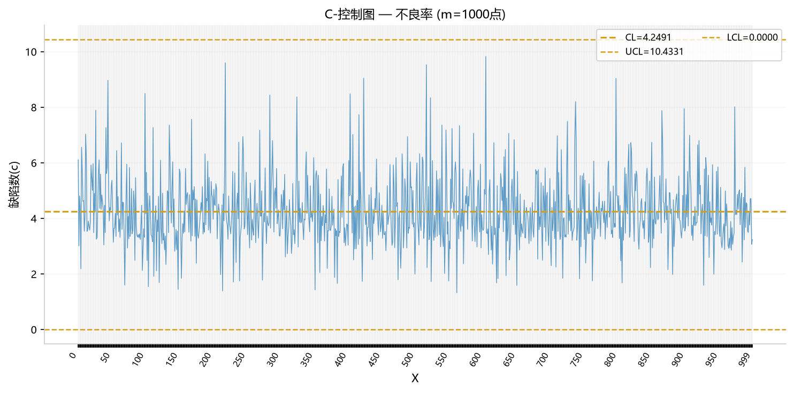
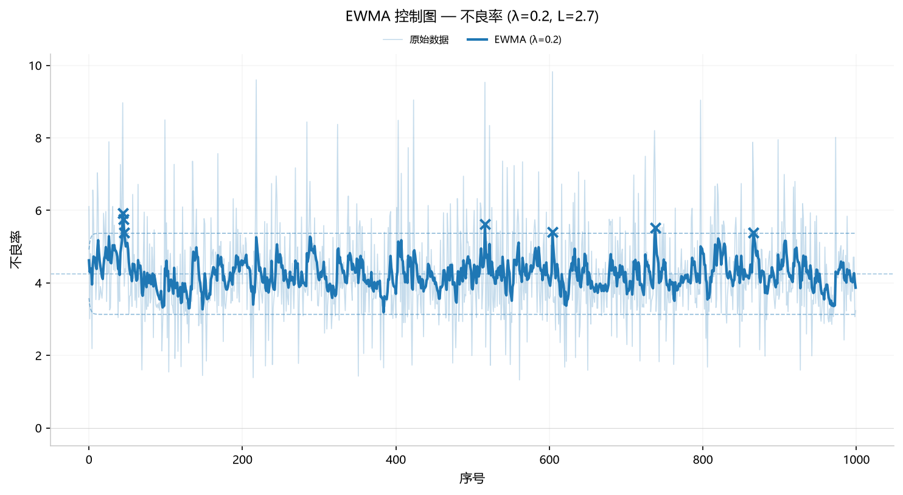
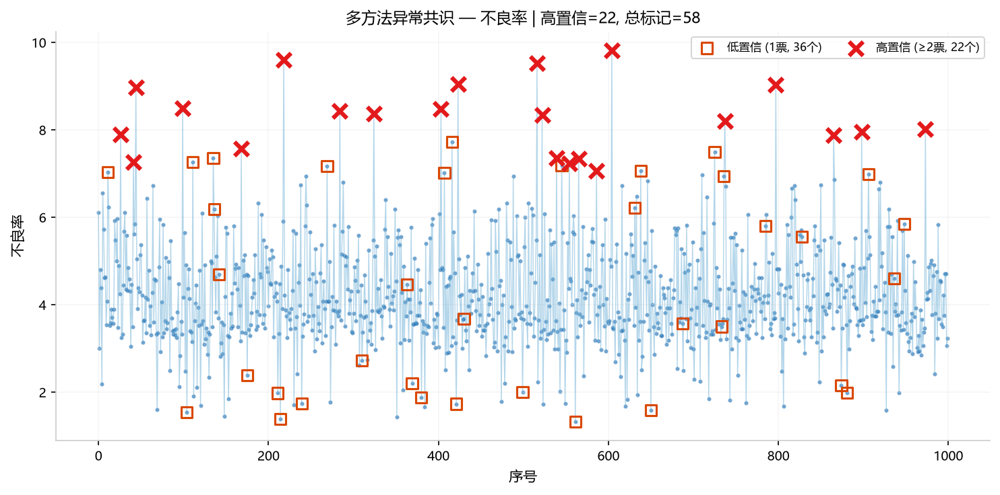
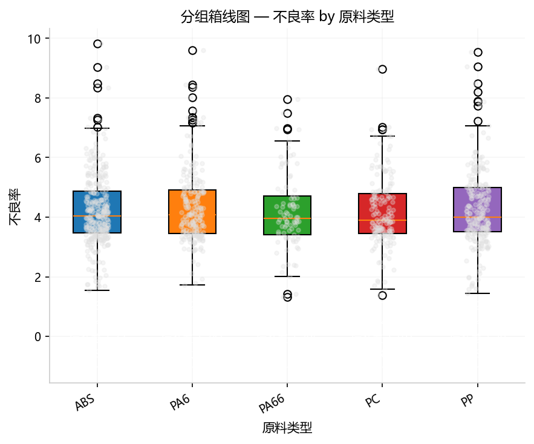
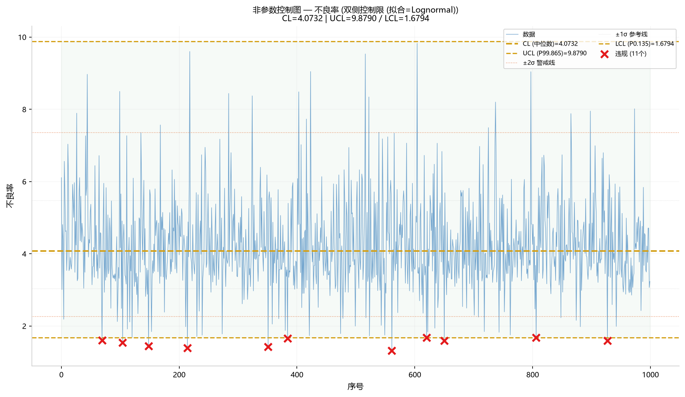

## 7. 过程监控

> 共 12 个方法。 "生产过程是否稳定？会不会快出问题了？"

### 7.1 X-bar/R 控制图 (`spc_xbar`)

**功能**: 均值-极差控制图，含 Western Electric 6 条规则自动检测。

#### 参数选择及说明

| 类别 | 选择 | 作用 |
|------|------|------|
| **X** | `日期` / `批次` | 横坐标列：类别/日期/数字均可。空→按数据出现顺序 |
| **Y** | `不良率` | 监控指标：按横坐标点聚合，计算各点的均值和极差 |
| **参数** | `group_col=车间` | 分组依据（可选）：按此列分系列，不同值=不同颜色的线 |
| **参数** | `usl`（可选） | 规格上限：在 X-bar 图上叠加 USL 水平线（红色实线） |
| **参数** | `lsl`（可选） | 规格下限：在 X-bar 图上叠加 LSL 水平线（红色实线） |
| **参数** | `target`（可选） | 目标值：在 X-bar 图上叠加 Target 水平线（灰色点线） |

> ⚠️ **协同要求**：必须标记 **1 个 Y（数值）**。X 列可选（空时按顺序），`group_col` 可选（空时单系列）。`usl`/`lsl` 可选，不影响控制限计算，仅用于图示参考。

#### 示例分析图片

_同一 X 值下的多行数据自然形成子组。n≤25 使用 R 图，n>25 自动切换为 S 图。无多点子组时自动使用 I 图（单值-移动极差）。_

#### 数值结果（Web UI ≡ Python）

X-bar 图（上）+ R 图（下），含 ±1σ/±2σ/±3σ 区域着色 + Western Electric 规则违规点红色标记。USL/LSL 规格线可选叠加在 X-bar 图上（点划线）。

#### 解读说明

见数值结果分析。

#### 补充备注

- **Python API**：`orchestrate(AnalysisRequest(task='spc_xbar', feature_cols=['日期'], params={'group_col': '车间'}, ...))`
### 7.2 计数型控制图 (`spc_attribute`)
**功能**: p（不良率）/ np（不良数）/ c（缺陷数）/ u（单位缺陷率）控制图。

#### 参数选择及说明

| 类别 | 选择 | 作用 |
|------|------|------|
| **X** | `批次` | 横坐标列：类别/日期/数字均可。空→按数据出现顺序 |
| **Y** | `不良率` | 计数指标：监控不良率（p 图）/不良数（np）/缺陷数（c）/单位缺陷率（u） |
| **参数** | `chart_type=c` | 图表类型：c=缺陷数控制图（Poisson），也可选 p/np/u |
| **参数** | `group_col`（可选） | 分组依据：按此列分系列，不同值=不同颜色的线 |
| **参数** | `n_col`（p/u 图需要，np 图推荐） | 样本量列：指定各子组的检验样本数（np 图要求子组缺陷计数 ≤ 样本量） |

> ⚠️ **协同要求**：必须标记 **1 个 Y（数值）**。`chart_type=p`、`u` 时需要 `n_col`；np 图按子组给定已聚合不良数时推荐指定 `n_col`（且要求计数 ≤ 样本量）。

#### 示例分析图片

*计数型控制图（c 图模式）：CL 约等于不良率均值，数据点随机分布在控制限内。*

#### 数值结果（Web UI ≡ Python） C 控制图，CL 约等于不良率均值。

#### 解读说明

见数值结果分析。

#### 补充备注

- **Python API**：`orchestrate(AnalysisRequest(task='spc_attribute', feature_cols=['批次'], params={'chart_type': 'c', 'group_col': '产线'}, ...))`
- **质量记录文本列**：可直接选择“合格/不合格、是/否”文本列。引擎自动映射 合格→1、不合格→0，**统计的是“1 事件”占比/计数**——若列以 1=合格 编码，p/np 图实际监控的是合格率而非不良率（控制限等价，解读时请勿把中心线当作不良率）；如需监控不良率，请将列编码为 1=不合格 后再分析。运行结果会给出相应语义提示。
- **np 图**：按子组给定已聚合不良数（count>1）时必须提供 `n_col` 样本量列，且要求 count ≤ n，否则报错。
### 7.3 CUSUM 控制图 (`spc_cusum`)

**功能**: 累积和控制图——对小偏移（0.5σ~2σ）比 X-bar 更敏感。输出双侧 CUSUM（C⁺上偏移 + C⁻下偏移）及决策区间。

#### 参数选择及说明

| 类别 | 选择 | 作用 |
|------|------|------|
| **Y** | `不良率` | 监控指标：CUSUM 对 0.5σ~2σ 的小偏移比 X-bar 更敏感 |
| **参数** | `k=0.5` | 松弛因子（默认 0.5σ）：允许的随机波动幅度 |
| **参数** | `h=5.0` | 决策区间（默认 5）：累积和超过此值触发报警 |
| **参数** | `group_col`（可选） | 分组依据：按此列分系列，不同值=不同颜色的线，独立计算 |
| **参数** | `mu`（需与 `sigma` 同时提供） | 过程均值：已知受控状态的 μ（不传则从数据估计；只传一个时无效） |
| **参数** | `sigma`（需与 `mu` 同时提供） | 过程标准差：已知受控状态的 σ（不传则从数据估计；只传一个时无效） |

> ⚠️ **协同要求**：必须标记 **1 个 Y（数值）**，至少 5 个数据点。有分组时每组独立估计 μ/σ 并独立检测报警。

#### 示例分析图片

*上：原始数据+均值线。下：C⁺(橙)和 C⁻(蓝)累积和 + h=5 决策区间(红虚线)。*

#### 数值结果（Web UI ≡ Python） 总报警 9 次（k=0.5, h=5.0）。不良率波动较大（随机数据），CUSUM 比 X-bar 更敏感。

#### 解读说明

见数值结果分析。

#### 补充备注

- **Python API**：`orchestrate(AnalysisRequest(task='spc_cusum', params={'k': 0.5, 'h': 5.0, 'group_col': '产线'}, ...))`
### 7.4 EWMA 控制图 (`spc_ewma`)

**功能**: 指数加权移动平均控制图——对近期数据权重更高，λ 越小越平滑。输出时变控制限和渐近控制限。

#### 参数选择及说明

| 类别 | 选择 | 作用 |
|------|------|------|
| **Y** | `不良率` | 监控指标：EWMA 给近期观测更高权重，平滑随机噪声 |
| **参数** | `lam=0.2` | 平滑参数 λ（0<λ≤1）：越小越平滑，λ=1 等同于原始数据 |
| **参数** | `L=2.7` | 控制限宽度（默认 2.7）：类似 Shewhart 的 3σ，常用 2.7~3.0 |
| **参数** | `group_col`（可选） | 分组依据：按此列分系列，不同值=不同颜色的线，独立计算 |
| **参数** | `mu`（需与 `sigma` 同时提供） | 过程均值：已知受控状态的 μ（不传则从数据估计；只传一个时无效） |
| **参数** | `sigma`（需与 `mu` 同时提供） | 过程标准差：已知受控状态的 σ（不传则从数据估计；只传一个时无效） |

> ⚠️ **协同要求**：必须标记 **1 个 Y（数值）**，至少 3 个数据点。有分组时每组独立估计 μ/σ 并独立计算 EWMA。

#### 示例分析图片

*蓝线=EWMA 平滑值(λ=0.2)，浅蓝=原始数据点，红虚线=时变控制限(L=2.7)。*

#### 数值结果（Web UI ≡ Python） EWMA 平滑线 + 时变控制限 + 违规点。

#### 解读说明

见数值结果分析。

#### 补充备注

- **Python API**：`orchestrate(AnalysisRequest(task='spc_ewma', params={'lam': 0.2, 'L': 2.7, 'group_col': '产线'}, ...))`
### 7.5 过程能力 Cp/Cpk (`process_capability`)
**功能**: 评估工艺是否满足规格要求，输出 Cp/Cpk/Pp/Ppk + Sigma Level + DPMO。

#### 参数选择及说明

| 类别 | 选择 | 作用 |
|------|------|------|
| **Y** | `不良率` | 评估指标：计算不良率的过程能力指数 Cp/Cpk/Pp/Ppk |
| **参数** | `usl=10` | ⚠️ **必填**：规格上限（客户/设计要求的不良率上限） |
| **参数** | `lsl=1` | ⚠️ **必填**：规格下限（不良率下限，通常为 0） |
| **参数** | `target`（可选） | 目标值：用于计算 Cpm（田口能力指数） |
| **参数** | `transform=boxcox`（可选） | 非正态数据变换：要求数据全部为正值，规格限也会同步变换 |

> ⚠️ **协同要求**：必须标记 **1 个 Y（数值）** + **同时提供 `usl` 和 `lsl`**（至少单侧）。`usl` 必须 > `lsl`，否则报错。输出 Cp/Cpk（短期）+ Pp/Ppk（长期）+ Sigma Level + DPMO + 直方图（含规格限竖线）。
>
> ⚠️ **数据顺序提示**：组内 σ（Cp/Cpk）默认用移动极差法（MR/1.128）估计，**隐含“数据按行序 = 采样时间顺序”假设**——请确保数据按时间排序后再上传；未排序会低估/高估组内波动。仅当数据恰为单点（无相邻差分）时才回退到整体 σ。

#### 示例分析图片

*直方图+正态拟合+规格限(LSL=1,USL=10)。Cpk=0.923<1.0不合格，中心偏左需调准。*

#### 数值结果（Web UI ≡ Python）

| 指标 | 值 | 95%CI |
|------|-----|-------|
| Cp (短期能力) | 1.279 | [1.223, 1.335] |
| Cpk (短期+偏倚) | 0.923 | [0.878, 0.969] |
| Pp (长期能力) | 1.208 | — |
| Ppk (长期+偏倚) | 0.872 | — |
| Sigma Level | 2.77σ | — |
| DPMO (双边，无偏移假设) | 5,605 | — |

#### 解读说明 Cp=1.28 > 1.0 说明潜在能力尚可（规格宽度 > 过程波动），但 Cpk=0.92 < 1.0 说明**过程中心偏离目标**。Cp > Cpk 的差距表明问题在"偏倚"而非"波动"——调准中心即可提升 Cpk。整体判定：不合格。

#### 补充备注

- **Python API**：`orchestrate(AnalysisRequest(task='process_capability', params={'usl': 10, 'lsl': 1}, ...))`
### 7.6 趋势预测 (`trend_forecast`)
**功能**: 线性趋势外推 + 残差诊断 (DW/Ljung-Box/ACF)。

#### 参数选择及说明

| 类别 | 选择 | 作用 |
|------|------|------|
| **Y** | `不良率` | 时序指标：按行顺序分析不良率的长期趋势和自相关性 |
| **X** | — | 本方法无需 X 列 |
| **参数** | `forecast_steps=5` | 预测步数：向前预测 5 个数据点的值及置信区间 |

> ⚠️ **协同要求**：必须标记 **1 个 Y（数值）**，至少 10 个数据点。数据按行顺序视为时间序列。

#### 示例分析图片

*趋势+预测(橙带)/残差(DW≈2)/ACF自相关/Actual vs Predicted(R²≈0)*

#### 数值结果（Web UI ≡ Python） R²=0.0002, DW=1.979, MAPE=N/A, RMSE=1.2415。数据无趋势（随机数据），预测区间较宽。2×2 诊断图（趋势+预测/残差/ACF/Actual vs Predicted）。

#### 解读说明

见数值结果分析。

#### 补充备注

- **Python API**：`orchestrate(AnalysisRequest(task='trend_forecast', params={'forecast_steps': 5}, ...))`
### 7.7 异常检测 (`anomaly_detect`)
**功能**: IQR / Z-score / Grubbs / Isolation Forest 四种方法检测异常点。

#### 参数选择及说明

| 类别 | 选择 | 作用 |
|------|------|------|
| **Y** | `不良率` | 检测目标：找出不良率中的异常值 |
| **X** | — | 本方法无需 X 列 |
| **参数** | `method=iqr` | 检测方法：IQR（四分位距，默认）也可选 zscore/isolation_forest |

> ⚠️ **协同要求**：必须标记 **1 个 Y（数值）**。

#### 示例分析图片

*红色X=异常点，橙色虚线=Q1-1.5IQR和Q3+1.5IQR上下界*

#### 数值结果（Web UI ≡ Python） 异常点数量 + 散点图标记（红色 X 标记异常点）。

#### 解读说明

见数值结果分析。

#### 补充备注

- **Python API**：`orchestrate(AnalysisRequest(task='anomaly_detect', params={'method': 'iqr'}, ...))`
### 7.8 变点检测 (`change_point`)
**功能**: 基于 CUSUM 识别过程结构性变化的位置。

#### 参数选择及说明

| 类别 | 选择 | 作用 |
|------|------|------|
| **Y** | `不良率` | 时序指标：检测不良率序列中均值或方差发生突变的位置 |
| **X** | — | 本方法无需 X 列 |
| **参数** | — | 自动检测多个变点，输出分段统计（均值/标准差/方向） |

> ⚠️ **协同要求**：必须标记 **1 个 Y（数值）**，至少 **20 个数据点**（引擎硬性下限，不足报错）。

> ⚠️ **适用场景**：本方法假设过程为**分段常数**（均值/方差阶跃突变）。**线性漂移/趋势**数据（如工具磨损）会被切成多段而误报变点——此类数据请改用趋势预测（7.6）分析。

#### 示例分析图片

*彩色水平线=各段均值，红色虚线=变点位置，红色箭头标注*

#### 数值结果（Web UI ≡ Python）

`segment_statistics`：

| 段 | 起始 | 结束 | 样本数 | 均值 | 标准差 |
|----|------|------|--------|------|--------|
| 1 | 0 | 999 | 1000 | 4.2491 | 1.2422 |

（test_data 的不良率列为随机生成数据，无结构性变化 → 未检测到显著变点。
对含阶跃的数据，算法定位准确——对固定 seed 数据的多场景实测偏差 ≤1 点（自动化测试锁定 ±3 点内，见 test_correctness）。）

#### 解读说明

- **未检测到变点**：过程整体平稳，无需分段分析。随机/稳态过程属正常结果，不代表功能失效。
- **判定依据**：CUSUM 标准化峰值阈值 min_peak_ratio=2.0（噪声下 max|W(t)|≈1.2，对应每段约 5% 误报率）——只有超过阈值的结构性变化才标记为变点。

#### 补充备注

- **算法**：CUSUM 二元分割，参数 `min_segment`（默认 max(10, n//20)）、`n_changepoints`（默认 5）、`min_peak_ratio`（默认 2.0，调低至 1.2-1.5 可提高灵敏度）。
- **Python API**：`orchestrate(AnalysisRequest(task='change_point', ...))`
### 7.9 异常共识 (`outlier_consensus`)
**功能**: IQR + Z-score + Isolation Forest 三种方法投票，≥2 票才是高置信异常。

#### 参数选择及说明

| 类别 | 选择 | 作用 |
|------|------|------|
| **Y** | `不良率` | 检测目标：3 种方法独立检测不良率异常，投票决定高置信异常 |
| **X** | `熔体温度` | 辅助维度：在多维空间中检测异常（IQR+IsoForest+LOF 三方法投票） |
| **参数** | — | 3 种方法（IQR/IsoForest/LOF）自动加权投票 |

> ⚠️ **协同要求**：必须标记 **1 个 Y + 至少 1 个 X**（数值）。≥2 票为高置信异常。

#### 示例分析图片

*红色X=高置信异常(≥2票)，橙色方块=低置信(1票)。三方法投票减少误报*

#### 数值结果（Web UI ≡ Python） 高置信异常 22 个（2.2%），总标记 58 个（5.8%）。IQR 标记最多、IsoForest 较少——多方法投票可有效减少误报。

#### 解读说明

见数值结果分析。

#### 补充备注

- **Python API**：`orchestrate(AnalysisRequest(task='outlier_consensus', ...))`
### 7.10 分组箱线图 (`box_chart`)  🆕

**功能**: 按类别因子分组展示数值分布，支持次分类分面。自动附 ANOVA/Kruskal-Wallis 或 t 检验/MWU 统计检验。

#### 参数选择及说明

| 类别 | 选择 | 作用 |
|------|------|------|
| **Y** | `不良率` | 分析目标：按原料类型分组展示不良率的分布差异 |
| **X(类)** | `原料类型` | ⚠️ 标记为**类别**：主分类变量（ABS/PP/PA6/PA66/PC 五组） |
| **参数** | — | 自动附 ANOVA/Kruskal-Wallis 检验结果 |

> ⚠️ **协同要求**：必须标记 **1 个 Y（数值） + 至少 1 个类别列**。

#### 示例分析图片

*分组箱线图 — 按原料类型(5组)的不良率分布，散点叠加展示个体差异。各组箱体高度相近，中位数接近。*

#### 数值结果（Web UI ≡ Python）

`group_statistics`：

| 分组 | 样本量 | 均值 | 中位数 | 标准差 | IQR | 最小值 | 最大值 |
|------|--------|------|--------|--------|-----|--------|--------|
| ABS | 315 | 4.217 | 4.043 | 1.220 | 1.406 | 1.542 | 9.825 |
| PA6 | 206 | 4.350 | 4.078 | 1.241 | 1.463 | 1.725 | 9.600 |
| PA66 | 85 | 4.190 | 3.950 | 1.295 | 1.298 | 1.322 | 7.950 |
| PC | 159 | 4.165 | 3.890 | 1.191 | 1.342 | 1.386 | 8.968 |
| PP | 235 | 4.282 | 3.997 | 1.290 | 1.467 | 1.445 | 9.532 |

#### 解读说明

5 组均值都在 4.17~4.35 之间，中位数在 3.89~4.08，差异极小。ANOVA p=0.615 不显著。各组的 IQR 约 1.3~1.5 说明组内离散度相近。

#### 参数选择及说明（带次分类分面）

| 类别 | 选择 | 作用 |
|------|------|------|
| **Y** | `不良率` | 分析目标：按原料类型+车间双维度展示不良率分布 |
| **X(类)** | `原料类型` | ⚠️ 标记为**类别**：主分类变量（箱线图 X 轴） |
| **X(类)** | `车间` | ⚠️ 标记为**类别**：次分类变量（≤8 水平时自动生成分面） |
| **参数** | — | 次分类生成 3 张分面箱线图（一/二/三车间各一张） |

> ⚠️ **协同要求**：标记 **1 个 Y（数值） + 至少 2 个类别列**。第一个类别列为主分类（X 轴），其余为次分类（分面）。

#### 数值结果（Web UI ≡ Python） 3 张分面箱线图（一车间/二车间/三车间各一张），每张 X 轴=原料类型。次分类 ≤ 8 个水平时自动分面。

#### 解读说明

见数值结果分析。

#### 补充备注

- **Python API**：`orchestrate(AnalysisRequest(task='box_chart', ...))`
### 7.11 非参数控制图 (`spc_nonparametric`) 🆕

**功能**: 基于最佳拟合分布的 CDF 逆推控制限，不假设正态分布。自动拟合 Normal/Lognormal/Weibull 三种分布，选 KS 检验最优者，用 PPF(CDF 逆函数)精确计算控制限。

**三种模式**:

| 模式 | 参数 | 适用场景 | 控制限 |
|------|------|---------|--------|
| 双侧 | `side: two-sided` | 一般质量指标 | UCL(P99.865) + LCL(P0.135) |
| 单侧上限 | `side: upper` | particle(越小越好) | 仅 UCL，超过=恶化 |
| 单侧下限 | `side: lower` | yield(越大越好) | 仅 LCL，低于=恶化 |

#### 参数选择及说明

| 类别 | 选择 | 作用 |
|------|------|------|
| **Y** | `不良率` | 监控指标：不假设正态分布，自动拟合最佳分布计算控制限 |
| **参数** | `side=two-sided` | 控制限方向：双侧（默认），也可选 upper（仅上限）/ lower（仅下限） |

> ⚠️ **协同要求**：必须标记 **1 个 Y（数值）**。自动拟合 Normal/Lognormal/Weibull 三种分布，选 KS 检验 p 值最大者，用 PPF(CDF 逆函数)计算控制限（P0.135/P99.865）。

#### 示例分析图片

*非参数控制图(双侧) — 控制限由 Lognormal 分布 PPF 计算，上下限不对称。红线=控制限, 绿线=中位数, 红X=违规点。*

#### 数值结果（Web UI ≡ Python）

| 统计量 | 值 |
|--------|-----|
| CL (分布中位数) | 4.073 |
| UCL (P99.865) | 9.879 |
| LCL (P0.135) | 1.679 |
| 最佳拟合分布 | Lognormal |

#### 解读说明

自动选择 Lognormal 拟合（偏度数据），控制限不对称——下限距中位数(2.39) &lt; 上限距中位数(5.81)。相比传统 ±3σ（假设正态），此法更准确反映偏态数据的真实尾部概率。

#### 补充备注

- **Python API**：`orchestrate(AnalysisRequest(task='spc_nonparametric', params={'side': 'two-sided'}, ...))`

### 7.12 散点图 (`scatter_plot`) 🆕

**功能**: X-Y 散点图，支持线性回归 (OLS) 或 LOWESS 拟合线、95% 置信带，可选按分组列着色。适用于探索两变量关系、验证线性假设、对比分组模式。

#### 参数选择及说明

| 类别 | 选择 | 作用 |
|------|------|------|
| **X** | `熔体温度` | X 轴数值列：自变量/解释变量 |
| **Y** | `不良率` | Y 轴数值列：因变量/响应变量 |
| **参数** | `fit=none` | 拟合类型：none=仅散点（默认），linear=OLS 线性回归+R²+方程，lowess=局部加权平滑 |
| **参数** | `show_ci=true` | 是否显示 95% 置信带（仅 linear 模式有效） |
| **参数** | `group_col`（可选） | 分组列：不同值用不同颜色标记，便于对比分组模式 |

> ⚠️ **协同要求**：必须标记 **1 个 X（数值）** + **1 个 Y（数值）**。X 列支持数字和文本（文本按出现顺序映射）。至少 3 个有效数据点（LOWESS 需 ≥5）。

#### 示例分析图片

*OLS 拟合线 + 95% 置信带。散点沿拟合线均匀分布说明线性假设基本成立。*

#### 数值结果（Web UI ≡ Python）

图表为主输出（无独立数据表）。summary 含数据点数、分组数、R²（如有拟合）和回归方程。

#### 解读说明

R² 越接近 1 说明线性关系越强。散点沿拟合线均匀分布 = 线性假设合理；呈漏斗形或弯曲 = 需变换或非线性模型。LOWESS 平滑线可辅助判断是否存在非线性趋势。

#### 补充备注

- **Python API**：`orchestrate(AnalysisRequest(task='scatter_plot', feature_cols=['熔体温度'], params={'fit': 'linear', 'show_ci': 'true', 'group_col': '车间'}, ...))`

---
