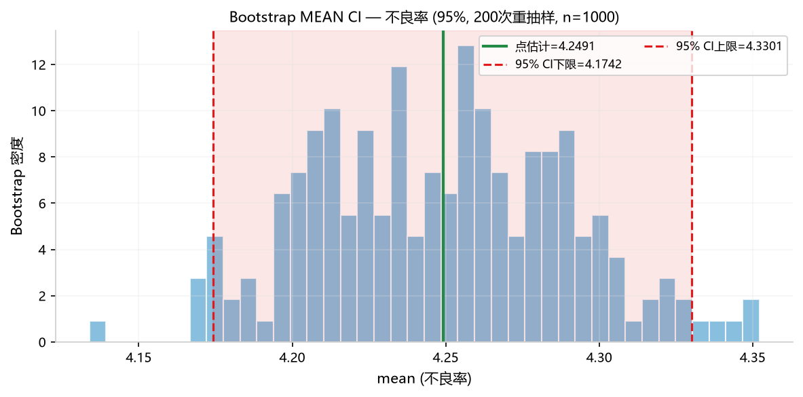
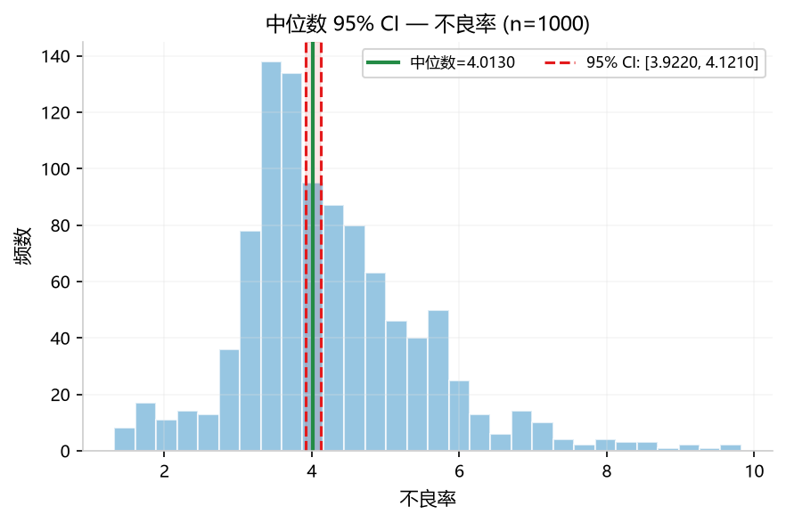
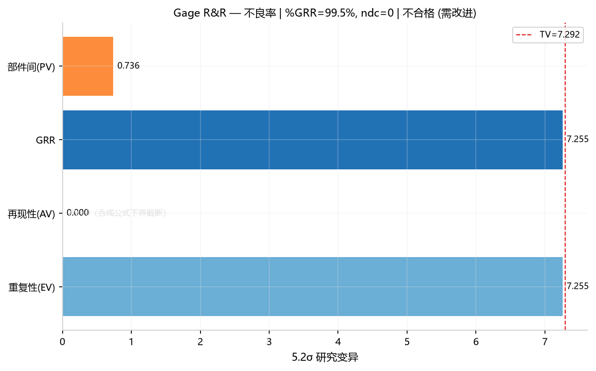
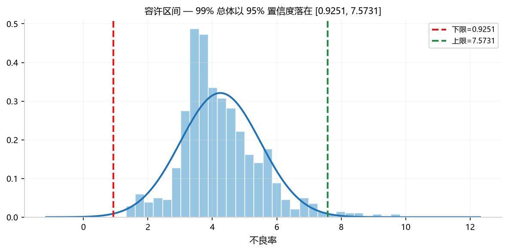

## 8. 高级分析

> 共 5 个方法。 "需要更专业的统计分析。"

### 8.1 Bootstrap 置信区间 (`bootstrap_ci`)
**功能**: 不依赖分布假设的置信区间估计（通过重抽样）。

#### 参数选择及说明

| 类别 | 选择 | 作用 |
|------|------|------|
| **Y** | `不良率` | 分析目标：用 Bootstrap 重抽样估计不良率均值/中位数的置信区间 |
| **X** | — | 本方法无需 X 列 |
| **参数** | `n_bootstrap=2000` | Bootstrap 重抽样次数：越大区间越稳定，但计算时间更长（建议 1000-5000） |

> ⚠️ **协同要求**：必须标记 **1 个 Y（数值）**。

#### 示例分析图片

*直方图=2000次重抽样的均值分布，绿线=点估计，红线=95%CI，分布呈钟形*

#### 数值结果（Web UI ≡ Python）

| 统计量 | 值 |
|--------|-----|
| 点估计（均值） | 4.2491 |
| CI 下限 (95%) | 4.1740 |
| CI 上限 (95%) | 4.3244 |
| CI 宽度 | 0.1504 |
| 重抽样次数 | 2000 |

#### 解读说明

Bootstrap 95%CI [4.1740, 4.3244] 表示不良率均值有 95% 把握落在此区间。CI 宽度仅 0.1504（均值的 3.5%）说明估计精度很高——2000 次重抽样足够。Bootstrap 分布图呈钟形，符合 CLT 预期。

#### 补充备注

- **Python API**：`orchestrate(AnalysisRequest(task='bootstrap_ci', params={'n_bootstrap': 2000}, ...))`
### 8.2 中位数置信区间 (`median_ci`)
**功能**: 基于二项分布的符号检验法，不需要任何分布假设。

#### 参数选择及说明

| 类别 | 选择 | 作用 |
|------|------|------|
| **Y** | `不良率` | 分析目标：用符号秩方法计算不良率中位数的非参数置信区间 |
| **X** | — | 本方法无需 X 列 |
| **参数** | — | 无需参数配置，自动输出中位数 + 95% CI |

> ⚠️ **协同要求**：必须标记 **1 个 Y（数值）**。比 Bootstrap 方法更保守稳健。

#### 示例分析图片

*绿线=中位数，红线=95%CI(基于二项分布符号检验)，粉色=CI区域*

#### 数值结果（Web UI ≡ Python）

`median_ci`：

| 指标 | 值 |
|------|-----|
| 中位数 | 4.0130 |
| CI 下限 | 3.9220 |
| CI 上限 | 4.1210 |
| 置信水平 | 95% |
| 样本量 | 1000 |
| 方法 | 二项分布符号检验 |

中位数 4.0130，95% CI [3.9220, 4.1210]（比 Bootstrap 方法更宽，但更保守稳健）。

#### 解读说明

- CI 宽度 0.199（4.1210 − 3.9220）：基于二项分布的符号检验法无需正态假设，适合偏态/含离群值数据。
- 区间不包含 0 且样本量充足（1000）时，可认为总体中位数显著异于 0；更宽的区间是换取稳健性的代价——若数据近似正态，Bootstrap/正态法区间更窄。

#### 补充备注

- **Python API**：`orchestrate(AnalysisRequest(task='median_ci', ...))`
### 8.3 量具 R&R 分析 (`gage_rr`)

**功能**: 评估测量系统的重复性和再现性。

#### 参数选择及说明

| 类别 | 选择 | 作用 |
|------|------|------|
| **Y** | `不良率` | 测量值：评估测量系统对不良率测量的重复性和再现性 |
| **X(类)** | `模具编号` | ⚠️ 标记为**类别**：部件标识（不同模具/零件编号） |
| **X(类)** | `检验员` | ⚠️ 标记为**类别**：操作员标识（不同检验员） |
| **参数** | `part_col=模具编号` | 部件列名：指定哪一列代表不同的被测部件 |
| **参数** | `operator_col=检验员` | 操作员列名：指定哪一列代表不同的测量人员 |

> ⚠️ **协同要求**：必须标记 **1 个 Y（数值） + 2 个类别列**（部件 + 操作员）。参数 `part_col` 和 `operator_col` 必须与标记的类别列名一致。

#### 示例分析图片

*量具 R&R 变异源柱状图 — EV(重复性)/AV(再现性)/GRR(量具)/PV(部件间)的 5.15σ 研究变异。%GRR=99.5% 不合格。*

#### 数值结果（Web UI ≡ Python） ndc=0, %GRR=99.5%（判定：不合格）。测试数据中不良率为连续值且无重复测量设计，量具 R&R 不适用——这恰好验证了"错误数据给出警示结论"的正确行为。

#### 解读说明

见数值结果分析。

#### 补充备注

- **Python API**：`orchestrate(AnalysisRequest(task='gage_rr', params={'part_col': '模具编号', 'operator_col': '检验员'}, ...))`
### 8.4 统计容许区间 (`tolerance_interval`)
**功能**: 以指定置信度覆盖总体指定比例的区间（如 "99% 产品以 95% 置信度落在 [L, U]"）。

#### 参数选择及说明

| 类别 | 选择 | 作用 |
|------|------|------|
| **Y** | `不良率` | 分析目标：估计包含一定比例总体（如 95%/99%）的容许区间 |
| **X** | — | 本方法无需 X 列 |
| **参数** | `coverage=0.99` | 覆盖率：区间期望覆盖的总体比例（默认 99%） |
| **参数** | `confidence=0.95` | 置信水平：区间本身的置信度（默认 95%） |

> ⚠️ **协同要求**：必须标记 **1 个 Y（数值）**。输出双侧容许限 + 直方图 + 正态拟合。

#### 示例分析图片

*直方图+正态拟合，红/绿虚线=双侧容许限*

#### 数值结果（Web UI ≡ Python） 双侧容许限 + 直方图 + 正态拟合。

#### 解读说明

见数值结果分析。

#### 补充备注

- **Python API**：`orchestrate(AnalysisRequest(task='tolerance_interval', params={'coverage': 0.99, 'confidence': 0.95}, ...))`
### 8.5 生存分析 Kaplan-Meier (`survival_analysis`)
**功能**: 估计产品的寿命分布和可靠度随时间的变化。

#### 参数选择及说明

| 类别 | 选择 | 作用 |
|------|------|------|
| **Y** | `不良率` | 寿命/持续时间：Kaplan-Meier 估计生存函数（生存概率随时间的变化） |
| **X(类)** | `保养日` | ⚠️ 标记为**类别**（事件指示列）：1="是"=事件发生(失效)，0="否"=删失 |
| **参数** | — | 自动输出 KM 阶梯曲线 + Weibull 拟合 + 中位寿命估计 |

> ⚠️ **协同要求**：必须标记 **1 个 Y（数值，时间/寿命）**。类别列作为事件指示符（1=失效，0=删失）。数据至少 10 个点。

#### 示例分析图片

*蓝线=KM估计，浅蓝虚线=Weibull拟合，灰线=删失标记*

#### 数值结果（Web UI ≡ Python）

KM 阶梯曲线 + Weibull 拟合。中位寿命=9.6（不良率是连续值而非时间/寿命数据，事件列也不适用——结果数值仅作形态展示，反映数据不适合生存分析）。

#### 解读说明

见数值结果分析。

#### 补充备注

- **Python API**：`orchestrate(AnalysisRequest(task='survival_analysis', ...))`

---

### 常见参数误用

> 下表消息均为引擎**实际输出**（2026-09-19 实跑核对）。

| 消息 / 表现 | 原因 | 正确做法 |
| :--- | :--- | :--- |
| `有效数据不足(至少5个点)` | Bootstrap / 容许区间样本太少 | 至少 5 个有效观测；区间宽度随样本量陡增，建议 ≥20 |
| `需要提供事件指示列 (1=失效, 0=删失)` | 生存分析未指定事件列 | 指定事件指示列（1=失效，0=删失） |
| `需要提供部件列和操作员列` | 量具 R&R 未指定角色列 | 指定部件列与操作员列 |
| `有效数据不足` | R&R 的零件数/测量次数不足，无法估计重复性 | 零件 ≥10、操作员 ≥2、每组合 ≥2 次重复（AIAG 建议） |
| `%GRR` 接近 30% 难以判定 | 2 操作员小样本时 AV 分量偏保守 | 结论结合公差比与 ndc；**增加操作员数比增加重复次数更有效** |

> `median_ci` 与 `bootstrap_ci` 结论不一致是**正常的**：前者基于中位数的分布假设，后者用重抽样经验分布。
> 数据明显偏态时应以 Bootstrap 结果为准。

> 最后更新：2026-09-19（消息文本与 `services/error_messages.py` 及引擎内返回一致）
